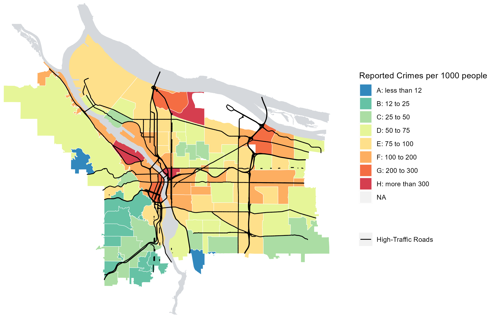
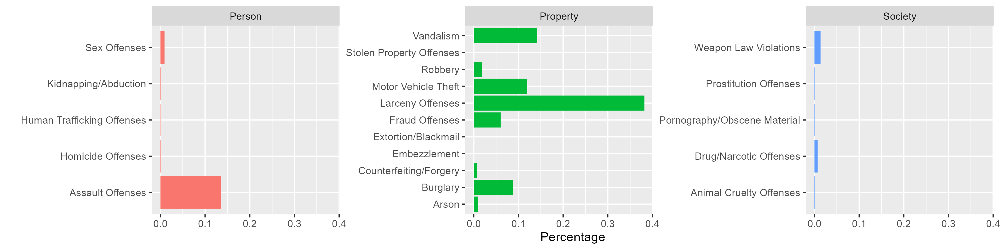

```{r setup, include=FALSE}
knitr::opts_chunk$set(echo = FALSE)
```

## Objectives

:::: {.column width=15%}
::::

:::: {.column width=70%}
- **Introduce the concept of statistical thinking**
- **Communicate the course learning outcomes**
- **Activity: Reading and Writing Exercises**
::::

:::: {.column width=15%}
::::

## Data Science

```{r data-science-life-cycle, echo=FALSE, fig.cap="The Data Science Life Cycle", fig.align='center', out.width = '50%'}
knitr::include_graphics("data-science-lifecycle.png")
```

## Statistical Thinking: An Overview

**What is statistical thinking?**

A way of understanding the world through data.

```{r statistical-thinking-1, echo=FALSE, fig.cap="Statistical Thinking in the Data Science Life Cycle", fig.align='center', out.width = '55%'}
knitr::include_graphics("statistical-thinking-in-data-science-lifecycle.png")
```

::: {style="color: red;"}
$\star$ Statistical thinking is our guiding principle as we learn statistical concepts and techniques.
:::

## Example 1: Statistical Question

*Question:* **What is the crime rate in Portland, OR?**

This question requires:

  1. Data collection from a representative sample of neighborhoods in Portland.
  2. Statistical analysis to estimate the average crime rate.

## Example 1: Preparation

*Question:* **What is the crime rate in Portland, OR?**

The analysis anticipates:

  1. **Variability.** No two neighborhoods will produce exactly the same result.
  2. **Uncertainty.** Because data varies, we’re often unsure about the "true" answer to the question.
  3. **Context.** Numbers alone don’t tell the whole story. You need to consider the situation, the method of data collection, and any potential biases.

## Example 1: Data Visualization

```{r portland-crime-rates, echo=FALSE, fig.cap="Portland crime rates in fiscal year 2020 to 2021.", fig.align='center', out.width = '55%'}

```

## Example 1: Confounders

*Follow-up question:* **What types of crimes are usually reported?**

```{r portland-types-of-crimes, echo=FALSE, fig.cap="Portland types of crimes in year 2020 to 2021.", fig.align='center', out.width = '100%'}

```

## Statistical Thinking: Steps

:::: {.column width=1%}
::::

:::: {.column width=47%}
```{r statistical-thinking-2, echo=FALSE, fig.cap="Statistical Thinking in the Data Science Life Cycle", fig.align='center', out.width = '100%'}
knitr::include_graphics("statistical-thinking-in-data-science-lifecycle.png")
```
::::

:::: {.column width=50%}
**Steps in Statistical Thinking:** 

  1. Ask a question or identify a problem
  2. Collect data, understand variability, identify patterns and relationships
  3. Apply statistical analysis
  4. Evaluate results and make a conclusion or predict an outcome
::::

:::: {.column width=1%}
::::

## Course Learning Outcomes (1/2)

:::: {.column width=1%}
::::

:::: {.column width=48%}
* **Data Fundamentals:**

  - *Understanding Data:* Comprehend data structures, collection methods, and limitations.
  - *Data Exploration:* Perform exploratory data analysis, including data visualization and descriptive statistics.
::::

:::: {.column width=48%}
* **Statistical Modeling:**

  - *Regression Analysis:* Apply and interpret linear regression models.
  - *Inferential Statistics:* Conduct hypothesis testing, construct confidence intervals, and perform estimation.
::::

:::: {.column width=1%}
::::

The full course learning outcomes and objectives is in the [Syllabus](../../index.html).

## Course Learning Outcomes (2/2)

:::: {.column width=1%}
::::

:::: {.column width=48%}
* **Probability Theory:**

  - *Foundations:* Understand random variables, probability distributions, and their applications in statistical analysis.
  
* **Data-Driven Conclusions:**

  - *Critical Evaluation:* Assess claims, draw meaningful conclusions from data, and make informed decisions.
::::

:::: {.column width=48%}
* **R Programming:**

  - *Implementation:* Develop and execute R code for data analysis, modeling, and visualization.

* **Communication:**

  - *Reporting:* Produce clear and concise written reports summarizing findings and insights.
::::

:::: {.column width=1%}
::::

The full course learning outcomes and objectives is in the [Syllabus](../../index.html).

## Activity: Reading and Writing Exercises

**Scenario:** Researchers conducted a study to understand whether drinking coffee impacts productivity at work. They collected data on how much coffee people drink daily and how productive they feel during their workday. The study examined whether there is a consistent pattern between coffee consumption and productivity levels.

**Discussion Questions:** Write your individual answers for the following questions on paper, then discuss them with your peers.

1. What is the main focus of the study?
2. How might coffee consumption affect productivity, based on your intuition?
3. What could a strong relationship between coffee consumption and productivity suggest for coffee drinkers?
4. What other factors (confounders) might influence both coffee consumption and productivity? How could these affect the study's conclusions?
5. If the study finds a meaningful connection, what practical advice could it offer to workers?

## References

::: {#refs}
:::
