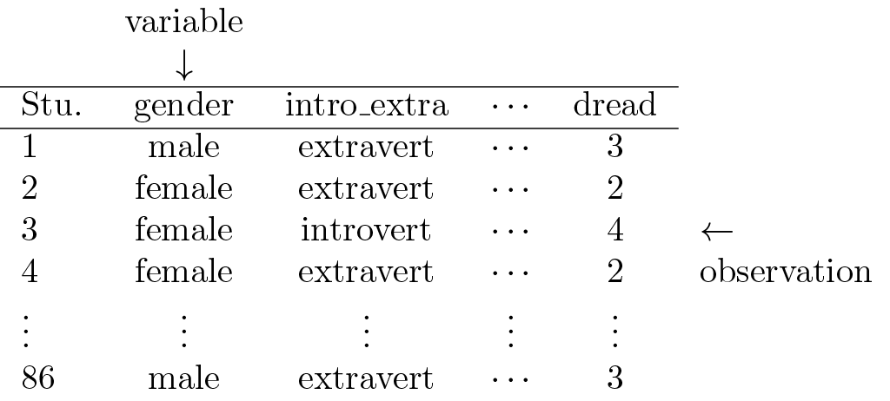
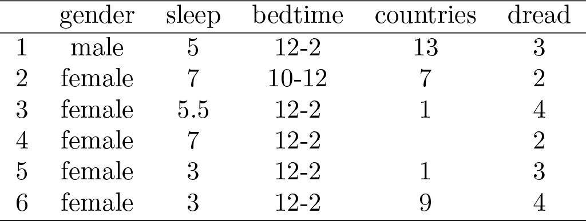

```{r setup, include=FALSE}
knitr::opts_chunk$set(echo = FALSE)
```

## Objectives

:::: {.column width=15%}
::::

:::: {.column width=70%}
- **Develop an understanding on how to identify different types of variables**
- **Know how data is organized into data tables**
- **Introduce R packages, variables, and data frames**
::::

:::: {.column width=15%}
::::

## Previously... (1/2)

```{r running-r-code-chunks, echo=FALSE, fig.cap="", fig.align='center', out.width = '75%'}
knitr::include_graphics("running-rmarkdown-vs-knitting.png")
```

## Previously... (2/2)

The guiding principle of statistics is statistical thinking.

```{r statistical-thinking-1, echo=FALSE, fig.cap="Statistical Thinking in the Data Science Life Cycle", fig.align='center', out.width = '55%'}
knitr::include_graphics("statistical-thinking-in-data-science-lifecycle.png")
```

## Types of Variables

```{r types-of-variables, echo=FALSE, fig.cap="Types of Variables", fig.align='center', out.width = '70%'}
knitr::include_graphics("variables.png")
```

## Numerical: Discrete vs Continuous

**Numerical variables** are quantitative variables that represent measurable amounts or quantities.

:::: {.column width=49%}
**Discrete**

* Take distinct, separate values (often whole numbers).
* Typically countable.
* Examples:
    - Number of students in a class (e.g. 25 students)
    - Books sold per day (e.g. 10 books/day)
::::

:::: {.column width=49%}
**Continuous**

* Can take any value within a range, including fractions and decimals.
* Measured rather than counted.
* Examples:
    - Height of a person (e.g., 5.7 ft).
    - Time taken to complete a task (e.g., 3.25 hours).
::::

## Categorical: Nominal vs Ordinal

**Categorical variables** are qualitative variables that represent labels or categories. They describe characteristics and are not inherently numerical.

:::: {.column width=49%}
**Nominal**

* Categories have no natural order or ranking.
* Used for labeling without quantitative significance.
* Examples:
    - Colors of cars (e.g., red, blue, green).
    - Types of animals (e.g., cat, dog, bird).
::::

:::: {.column width=49%}
**Ordinal**

* Categories have a meaningful order or ranking, but the intervals between ranks are not consistent.
* Examples:
    - Education level (e.g., high school, bachelor’s, master’s).
    - Customer satisfaction (e.g., satisfied, neutral, dissatisfied).
::::

## Case Study 1

A survey was conducted on students in an introductory statistics course. Below are a few of the questions on the survey, and the corresponding variables the data from the responses were stored in:

:::: {.column width=15%}
::::

:::: {.column width=70%}
* **gender:** What is your gender?
* **intro_extra:** Are you an introvert or an extrovert?
* **sleep:** How many hours do you sleep at night, on average?
* **bedtime:** What time do you usually go to bed?
* **countries:** How many countries have you visited?
* **dread:** On a scale of 1-5, how much do you dread being here?
::::

:::: {.column width=15%}
::::

## Case Study 1: Data Matrix

Data collected on students in a statistics class on a variety of variables:

```{r data-matrix-with-labels, echo=FALSE, fig.cap="Example Data Matrix", fig.align='center', out.width = '70%'}

```

## Case Study 1: Identify Types of Variables

:::: {.column width=50%}
```{r data-matrix, echo=FALSE, fig.cap="", fig.align='center', out.width = '100%'}

```
::::

:::: {.column width=49%}
* **gender:** nominal categorical
* **sleep:** continuous numerical
* **bedtime:** ordinal categorical
* **countries:**  discrete numerical
* **dread:** ordinal categorical - could also be used as numerical
::::

## R Variables

**How are variables created and stored in R?**

```{r variable-defined, echo=FALSE, fig.cap="", fig.align='center', out.width = '50%'}
knitr::include_graphics("how-variables-are-stored.png")
```

::: {style="color: blue"}
$\dagger$ Create a variable named `ria` and initially define it as a number. Then, redefine `ria` as a vector. What happens to the original value of `ria` (the number) after it is redefined as a vector?
:::

## Introduction to Data Frames

:::: {.column width=15%}
::::

:::: {.column width=70%}
**What is a data frame?**

* A data frame is a key data structure in R used for storing data sets.
* It organizes data into rows and columns, similar to a spreadsheet.
* Each column can contain data of a different variable type (e.g., numeric, character, vector).
::::

:::: {.column width=15%}
::::

## Data Frame Key Characteristics

:::: {.column width=49%}
**Base R:** These data frames are data structures that comes with base R.

```{r r-base-df-view, echo=FALSE, fig.cap="", fig.align='center', out.width = '90%'}
knitr::include_graphics("data-frame-r-base.png")
```
::::

:::: {.column width=49%}
**Tibbles:** Tibbles are special kinds of data frames using the `tibble` package.

```{r tibble-df-view, echo=FALSE, fig.cap="", fig.align='center', out.width = '90%'}
knitr::include_graphics("data-frame-tibble.png")
```
::::

::: {style="color: red"}
$\star$ A base R data frame can be converted to a tibble data frame using the `tibble()` function. The `iris` data set is a built-in data in the `datasets` packages, which comes with base R.
:::

## R Packages

:::: {.column width=15%}
::::

:::: {.column width=70%}
**What are R packages?**

* Packages in R are collections of functions, data, and documentation that extend the capabilities of base R.
* It includes manuals and examples to help users understand how to use the package.
::::

:::: {.column width=15%}
::::

## Base R versus R Packages

| **Aspect** | **Base R** | **R Packages** |
|:---|:------|:------|
| *Availability* | Comes pre-installed with R | Must be installed and loaded |
| *Functionality* | Offers basic statistical and programming tools | Provides advanced or specialized tools not included in base R |
| *Customization* | Limited to what's already available | Highly customizable; users can install or even create their own packages |
| *Performance* | Base R can sometimes be slower or more verbose | Packages often include optimized or simpler syntax for complex tasks |
| *Speciality* | Limited only for basic statistics | Often built for a specific purpose or knowledge |

## The `tidyverse` Package

:::: {.column width=40%}
`tidyverse` is a collection of packages suited for data processing and visualization.

```{r tidyverse-hex, echo=FALSE, fig.cap="", fig.align='center', out.width = '60%'}
knitr::include_graphics("tidyverse.png")
```
::::

:::: {.column width=59%}
Core packages specifically for data processing:

:::: {.column width=20%}
```{r dplyr-hex, echo=FALSE, fig.cap="", fig.align='left', out.width = '100%'}
knitr::include_graphics("dplyr.png")
```

```{r tidyr-hex, echo=FALSE, fig.cap="", fig.align='left', out.width = '100%'}
knitr::include_graphics("tidyr.png")
```

```{r tibble-hex, echo=FALSE, fig.cap="", fig.align='left', out.width = '100%'}
knitr::include_graphics("tibble.png")
```
::::

:::: {.column width=78%}
* `dplyr` provides a grammar for data transformation.
* `tidyr` provides a set of functions that help you get data in consistent form.
* `tibble` is a data frame that prioritize simplicity, enforcing stricter checks to promote cleaner, more expressive code.
::::

::::

## Installing Packages

**How to install R Packages?**

The following two methods installs the `tidyverse` package.

:::: {.column width=49%}
* **Using the "Tools" menu**

```{r tools-install, echo=FALSE, fig.cap="", fig.align='center', out.width = '80%'}
knitr::include_graphics("installing-r-packages.png")
```
::::

:::: {.column width=50%}
* **Using the R Console Directly**

```{r tidyverse-install, message=FALSE, warning=FALSE, eval=FALSE, echo=TRUE}
install.packages("tidyverse")
```

::: {style="color: blue"}
$\dagger$ Try the above code sequence in your console. Then, install a different package called `plotly`.
:::

::: {style="color: red"}
$\star$ Knitting an RMarkdown with this function in a code chunk will give you an error. You need to run it directly on the console.
:::
::::

## Loading Packages

**How to load R Packages?**

The function `library()` loads any installed package. In this case `library("tidyverse")` loads the `tidyverse` package specifically.

```{r warning=FALSE, echo=TRUE}
library("tidyverse")
```

::: {style="color: blue"}
$\dagger$ Try the above code sequence in your console. Then, load the package `plotly`.
:::

## Data Frame Subsetting

**How to Subset a Data Frame?** Data frames are organized into rows and columns and can be accessed in the following ways:

:::: {.column width=49%}
  * Accessing a column by Name using `$`
```{r echo=TRUE, eval=FALSE}
iris$Species
```

  * Accessing a column by name using `[]`
```{r echo=TRUE, eval=FALSE}
iris[,"Species"]
```

  * Accessing multiple columns using a vector of names
```{r echo=TRUE, eval=FALSE}
iris[,c("Species","Sepal.Length")]
```
::::

:::: {.column width=50%}
  * Accessing rows by an index
```{r echo=TRUE, eval=FALSE}
iris[42,]
```

  * Accessing specific rows and columns by index or name
```{r echo=TRUE, eval=FALSE}
iris[42,c("Species","Sepal.Length")]
```

  * Accessing specific rows according to some condition
```{r echo=TRUE, eval=FALSE}
iris[iris$Species == "setosa",]
```
::::

::: {style="color: blue"}
$\dagger$ Try to subset the `iris` data set, accessing the "viriginica" in the `Species` column.
:::

::: {style="color: red"}
$\star$ The above examples uses the `iris` data set, which comes with base R.
:::

## Subset a Data Frame based on Conditions

**Define Data Frame as a Tibble**

```{r echo=TRUE, eval=TRUE}
iris_tibble <- tibble(iris)
```

**Example:** The following code sequence subsets the `iris` dataframe (in tibble form) to include only the "versicolor" species, and all rows with `Sepal.Length` at least $6$. 

```{r echo=TRUE, eval=FALSE}
# subset by species to match "versicolor"
iris_versicolor <- iris_tibble[iris_tibble$Species == "versicolor",]
# subset rows with Sepal.Length at least 6
iris_versicolor2 <- iris_versicolor[iris_versicolor$Sepal.Length >= 6,]
# display result
glimpse(iris_versicolor2)
```

::: {style="color: red"}
$\star$ The code sequence above uses different variable definitions to track subsetting conditions sequentially.
:::
