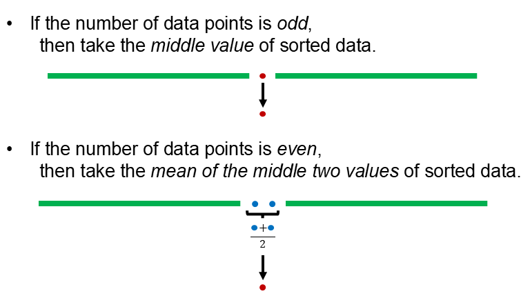
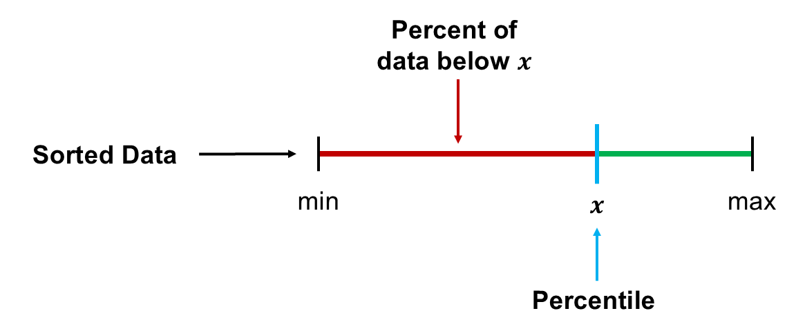
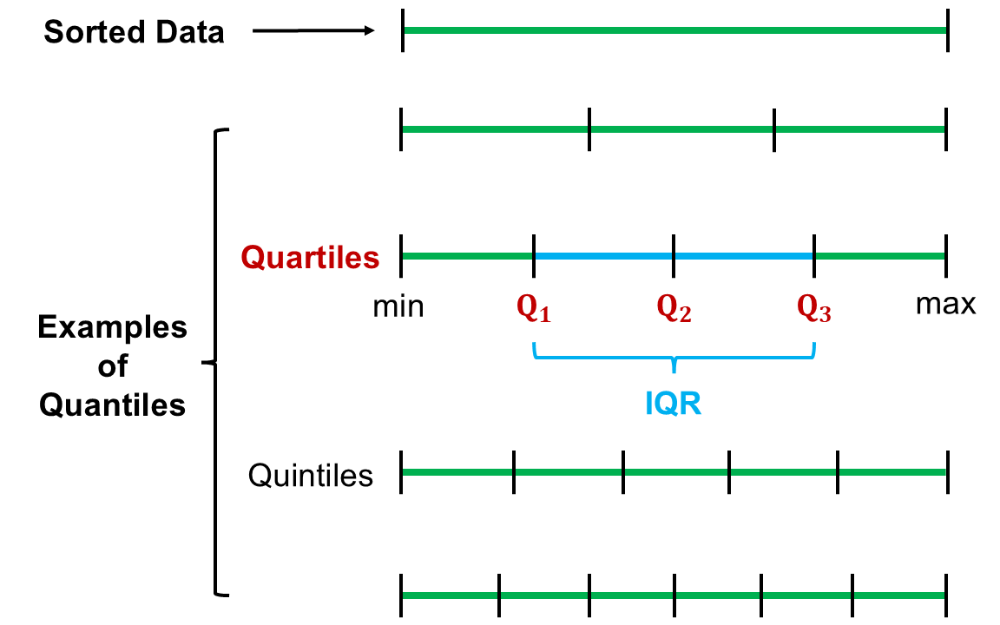

```{r setup, include=FALSE}
knitr::opts_chunk$set(echo = FALSE)
```

## Objectives

:::: {.column width=15%}
::::

:::: {.column width=70%}
- **Know the basics of wrangling and summarising a data frame**
- **Develop an unerstanding on computing descriptive statistics of variables**
- **Introduce the language of the `dplyr` package**
::::

:::: {.column width=15%}
::::

## Previously... (1/2)

**Types of Variables**

```{r types-of-variables, echo=FALSE, fig.cap="Types of Variables", fig.align='center', out.width = '70%'}
knitr::include_graphics("variables.png")
```

## Previously... (2/2)

:::: {.column width=49%}
**R Packages:** `tidyverse` is a collection of packages suited for data processing and visualization, which includes `tibble` and `dplyr` packages.

```{r echo=TRUE, message=FALSE, warning=FALSE}
library(tidyverse)
```

```{r tidyverse-hex, echo=FALSE, fig.cap="", fig.align='center', out.width = '60%'}
knitr::include_graphics("tidyverse.png")
```
::::

:::: {.column width=49%}
**Tibbles:** Tibbles are special kinds of data frames using the `tibble` package in `tidyverse`.

```{r tibble-df-view, echo=FALSE, fig.cap="", fig.align='center', out.width = '90%'}
knitr::include_graphics("data-frame-tibble.png")
```
::::

## Descriptive Statistics

**Descriptive statistics** involves organizing, summarizing, and presenting data in an informative way. It Focuses on describing and understanding the main features of a dataset.

:::: {.column width=49%}
**For Numerical Variables**

* Measures of Central Tendency
    - Mean (Average), Median, and Mode
* Measures of Dispersion (Spread)
    - Range, Variance, Standard Deviation, Interquartile Range (IQR)
::::

:::: {.column width=49%}
**For Categorical Variables**

* Frequency
* Relative Frequency (Proportion)
* Percentage
::::

## The Mean

The **sample mean**, denoted as $\overline{x}$, can be calculated as $$\overline{x} = \frac{x_1 + x_2 + \cdots + x_n}{n}$$ where $x_1, x_2, \cdots, x_n$ represent the $n$ observed values.

In other words, the **mean (or average)** is the *sum* of all data points divided by the *number of points*: $$\text{mean} = \frac{\text{sum of all data points}}{\text{number of data points}}.$$

## Computing the Mean

**Example:** What is the mean of the data set $7,1,2,4,6,3,2,7$?

:::: {.column width=60%}
* *Manual Computation:*

\[
\begin{aligned}
 \overline{x} & = \frac{7+1+2+4+6+3+2+7}{8} \\
             & = 4
\end{aligned}
\]
::::

:::: {.column width=39%}
* *Using R:*

```{r mean-example, echo=TRUE}
num_data <- c(7,1,2,4,6,3,2,7)
mean(num_data)
```
::::

So, the mean is $4$.

## The Median

The **median** is the *middle value* when the data is *sorted*.

The median is computed using the following cases:

```{r median-illustration, echo=FALSE, fig.cap="", fig.align='center', out.width = '60%'}

```

## Computing the Median

**Example:** What is the median of the data set $7,1,2,4,6,3,2,7$?

:::: {.column width=60%}
* *Manual Computation:*

The number of data points is $8$, an even number.
$$\text{sorted data} \longrightarrow 1,2,2,\color{blue}{\mathbf{3}},\color{blue}{\mathbf{4}},6,7,7$$

\[
\begin{aligned}
 \text{median} & = \frac{\text{sum of two middle values}}{2} \\
             & = \frac{\color{blue}{\mathbf{3}}+\color{blue}{\mathbf{4}}}{2} \\
             & = 3.5
\end{aligned}
\]
::::

:::: {.column width=39%}
* *Using R:*

```{r median-example-1, echo=TRUE}
num_data <- c(7,1,2,4,6,3,2,7)
sort(num_data)
median(num_data)
```
::::

So, the median is $3.5$.

## Percentiles

A **percentile** is a measure used to indicate the value below which a given percentage of observations fall.

The formula for computing the percentile rank and the percentile it given by $$\text{percentile of } x = \frac{\text{number of values below } x}{\text{total number of values}} \times 100$$ where $x$ is a value in the data.

```{r percentiles-diagram, echo=FALSE, eval=TRUE, fig.cap="", fig.align='center', out.width = '60%'}

```

::: {style="color: red;"}
$\star$ **Key Idea:** The percentile is the value below which a certain percentage of the data lies.
:::

## Computing Percentiles

**Example:** What is the percentile of $6$ in the data set $7,1,2,4,6,3,2,7$?

:::: {.column width=60%}
* *Manual Computation:*

$$\text{sorted data} \longrightarrow \color{red}{\mathbf{1}},\color{red}{\mathbf{2}},\color{red}{\mathbf{2}},\color{red}{\mathbf{3}},\color{red}{\mathbf{4}},\color{blue}{\mathbf{6}},7,7$$

\[
\begin{aligned}
\text{percentile of } \color{blue}{\mathbf{6}} & = \frac{5}{8} \times 100 \\
                        & = 62.5
\end{aligned}
\]
::::

So, the data value $6$ is in the $62.5$th percentile, or 62.5\% of the data is below $6$.

## Computing Percentiles in Reverse

**Example:** What is the 30th percentile of the data set $7,1,2,4,6,3,2,7$? (What is the value in the data below which 30\% of the data lies?)

:::: {.column width=60%}
* *Manual Computation:*

\[
\begin{aligned}
30\% & = \frac{\text{number of values below } x}{8} \times 100 \\
0.30 \times 8 & = \text{number of values below } x \\
2.40 & = \text{number of values below } x \\
2 & \longleftarrow  \text{rounded to nearest integer}
\end{aligned}
\]

$$\text{sorted data} \longrightarrow \color{red}{\mathbf{1}},\color{red}{\mathbf{2}},\color{blue}{\mathbf{2}},3,4,6,7,7$$

\[
\begin{aligned}
30\text{th percentile} & \approx 2
\end{aligned}
\]
::::

:::: {.column width=39%}
* *Using R:*

```{r percentile-reverse-example, echo=TRUE}
num_data <- c(7,1,2,4,6,3,2,7)
quantile(num_data,c(0.30))
```
::::

So, the $30$th percentile is approximately $2$, or precisely $2.1$. This is a consequence of considering a small dataset when computing by hand.

::: {style="color: red;"}
$\star$ **Note:** Whether the $30$th percentile is exactly $2$ or $2.1$ depends on the dataset and the method used to compute percentiles. In fact, $2$ is exactly the $25$th percentile and $2.1$ is exactly the $30$th percentile, but due to approximation, the values are close.
:::

## $\mathbf{Q}_1$, $\mathbf{Q}_2$, $\mathbf{Q}_3$, and the IQR

**$\mathbf{Q}_1$ (the 1st quartile)**, **$\mathbf{Q}_2$ (the 2nd quartile)**, **$\mathbf{Q}_3$ (the 3rd quartile)**, and the **IQR (interquartile range)** are statistical measures used to describe the spread and distribution of a dataset:

* The **1st quartile** is also called the **25th percentile**, $Q_1$.
* The **2nd quartile (median)** is also called the **50th percentile**, $Q_2$.
* The **3rd quartile** is also called the **75th percentile**, $Q_3$.
* Between $Q_1$ and $Q_3$ is the **middle 50\% of the data**. The range these data span is called the **interquartile range**, or the **IQR**.
$$\text{IQR} = Q_3 - Q_1$$

::: {style="color: red;"}
$\star$ **Key Idea:** The numerical data is divided into four sections (quartiles), which is saying that the data is split into four equal parts, each containing 25\% ($Q_1$), 50\% ($Q_2$), and 75\% ($Q_3$) of the observations when arranged in ascending order.
:::

## Quantiles

In general, quartiles are called quantiles, which are values that split sorted data into equal parts. Quartiles are just quantiles where we split the data into four parts.

```{r quantiles-diagram, echo=FALSE, eval=TRUE, fig.cap="", fig.align='center', out.width = '60%'}

```

## Computing the Quartiles

**Example:** What are the quartiles of the data set $7,1,2,4,6,3,2,7$?

:::: {.column width=60%}
* *Manual Computation:*

$$\text{sorted data} \longrightarrow 1,2,2,3,4,6,7,7$$

Note that the number of data points is $8$, an even number.

\[
\begin{aligned}
25\text{th percentile} & \approx 2 \\
50\text{th percentile (median)} & = \frac{3+4}{2} = 3.50 \\
75\text{th percentile} & \approx 6 \\
\end{aligned}
\]

Note that these are approximations due to the small dataset size, but the concept of percentiles still holds.
::::

:::: {.column width=39%}
* *Using R:*

```{r quartiles-example, echo=TRUE}
num_data <- c(7,1,2,4,6,3,2,7)
quantile(num_data)
```
::::

So, the quartiles are $Q_1 = 2$, $Q_2 = 3.50$, and $Q_3 = 6.25$.

## Computing the IQR

**Example:** What is the IQR of the data set $7,1,2,4,6,3,2,7$?

:::: {.column width=60%}
* *Manual Computation:*

\[
\begin{aligned}
& Q_1 \approx 2 \\
& Q_2 \text{ (median)} = \frac{3+4}{2} = 3.50 \\
& Q_3 \approx 6.25
\end{aligned}
\]

\[
\begin{aligned}
\text{IQR} & = Q_3 - Q_1 \\
           & = 6.25 - 2 \\
           & = 4.25
\end{aligned}
\]
::::

:::: {.column width=39%}
* *Using R:*

```{r iqr-example, echo=TRUE}
num_data <- c(7,1,2,4,6,3,2,7)
IQR(num_data)
```
::::

So, the IQR is $4.25$.

## Range

The **range** is the difference between the maximum and minimum of the numerical data.

The formula for the range is given by $$\text{range} = x_{max} - x_{min}$$ where $x_{max}$ is the maximum value and $x_{min}$ minimum value.

## Computing the Range

**Example:** What is the range of the data set $7,1,2,4,6,3,2,7$?

:::: {.column width=60%}
* *Manual Computation:*

$$\text{sorted data} \longrightarrow \color{blue}{\mathbf{1}},2,2,3,4,6,7,\color{blue}{\mathbf{7}}$$
\begin{aligned}
 \text{range} & = \color{blue}{\mathbf{7}} - \color{blue}{\mathbf{1}} \\
              & = 6
\end{aligned}
::::

:::: {.column width=39%}
* *Using R:*

```{r range-example, echo=TRUE}
num_data <- c(7,1,2,4,6,3,2,7)
max(num_data) - min(num_data)
```
::::

So, the range is $6$.

## Variance

The **variance** is roughly the average squared deviation from the mean.

The formula for the variance is given by $$s^2 = \frac{(x_1 - \bar{x})^2 + (x_2 - \bar{x})^2 + \cdots (x_n - \bar{x})^2}{n-1}$$ where $x_1, x_2, \cdots, x_n$ are the data points, $\bar{x}$ is the sample mean, and $n$ is the sample size.

**What is the meaning of the variance?**

:::: {.column width=15%}
::::

:::: {.column width=70%}
* A measure of how spread out data points are around the mean.
* Indicates the level of uncertainty or variability in a dataset.
::::

:::: {.column width=15%}
::::

## Computing the Variance

**Example:** What is the variance of the data set $7,1,2,4,6,3,2,7$?

:::: {.column width=60%}
* *Manual Computation:*
\[
\begin{aligned}
 \text{mean} \longrightarrow \bar{x} & = \frac{7+1+2+4+6+3+2+7}{8} \\
                                     & = 4
\end{aligned}
\]

\[
\begin{aligned}
 \text{variance} \longrightarrow s^2 & = \frac{\begin{matrix} (7-4)^2 + (1-4)^2 + \\
                                                              (2-4)^2 + (4-4)^2 + \\
                                                              (6-4)^2 + (3-4)^2 + \\
                                                              (2-4)^2 + (7-4)^2
                                               \end{matrix}}{8-1} \\
                                     & = 5.714
\end{aligned}
\]
::::

:::: {.column width=39%}
* *Using R:*
```{r variance-example, echo=TRUE}
num_data <- c(7,1,2,4,6,3,2,7)
var(num_data)
```
::::

So, the variance is $5.714$.

## Variance is Always Positive

**Why do we use the squared deviation in the calculation of variance?**

:::: {.column width=15%}
::::

:::: {.column width=70%}
* To get rid of negatives so that observations equally distant from the mean are weighed equally.
* To weigh larger deviations more heavily.
::::

:::: {.column width=15%}
::::

::: {style="color: red;"}
$\star$ Variance is the average of the squared differences between each data point and the mean.
:::

## Standard Deviation (SD)

The **standard deviation (SD)** is the square root of the variance, and has the same units as the data.

The formula for the standard deviation is given by $$s = \sqrt{s^2}$$ where $s^2$ is the variance.

**What is the meaning of the standard deviation?**

:::: {.column width=15%}
::::

:::: {.column width=70%}
* Standard deviation is a measure of how spread out the values in a dataset are.
* It quantifies the amount of variation or dispersion of a set of data points.
* Helps understand data consistency.
::::

:::: {.column width=15%}
::::

## Computing the SD

**Example:** What is the standard deviation of the data set $7,1,2,4,6,3,2,7$?

:::: {.column width=60%}
* *Manual Computation:*

\[
\begin{aligned}
 \text{mean} \longrightarrow \bar{x} & = \frac{7+1+2+4+6+3+2+7}{8} \\
                                     & = 4
\end{aligned}
\]

\[
\begin{aligned}
 \text{variance} \longrightarrow s^2 & = \frac{\begin{matrix} (7-4)^2 + (1-4)^2 + \\
                                                              (2-4)^2 + (4-4)^2 + \\
                                                              (6-4)^2 + (3-4)^2 + \\
                                                              (2-4)^2 + (7-4)^2
                                               \end{matrix}}{8-1} \\
                                     & = 5.714
\end{aligned}
\]

\[
 \text{standard deviation} \longrightarrow s = \sqrt{5.714} = 2.390
\]
::::

:::: {.column width=39%}
* *Using R:*

```{r standard-deviation-example, echo=TRUE}
num_data <- c(7,1,2,4,6,3,2,7)
sd(num_data)
```
::::

So, the standard deviation is $2.390$.

## The Frequency

The **frequency** is the number of observations in each category.

The method of computing the frequencies of a categorical variable is as follows:

:::: {.column width=15%}
::::

:::: {.column width=70%}
* List all unique categories in the data
* Count the number of observations of each category
* List the counts with their corresponding unique categories
::::

:::: {.column width=15%}
::::

## Computing the Frequency

**Example:** How many *b* and *g* are there in the data listed below?

$$b, g, g, b, b, g, b, b$$

:::: {.column width=39%}
* *Manual Computation:*

The unique categories are *b* and *g*.

Number of occurrences: 
\[
\begin{aligned}
b,b,b,b,b & \longrightarrow 5 \\
g,g,g & \longrightarrow 3
\end{aligned}
\]
::::

:::: {.column width=60%}
* *Using R:*

```{r echo=TRUE}
cat_data <- c("b","g","g","b","b","g","b","b")
table(cat_data)
```
::::

So, there are $5$ *b* and $3$ *g*.

## The Relative Frequency and Percentage

The **relative frequency** is the proportion of observations in each category.

The proportion is computed using the formula $$\text{proportion of a category} = \frac{\text{number of cases of a category}}{\text{total number of cases}}.$$

The **percentage** is the relative frequency multiplied by 100: $$\text{percentage of a category} = \text{proportion of a category } \times 100.$$

## Computing the Relative Frequency

**Example:** What are the proportions of *b* and *g* in the data listed below?

$$b, g, g, b, b, g, b, b$$

:::: {.column width=39%}
* *Manual Computation:*

The number of occurrences are the same as the previous example.

Number of cases: $8$

Proportions:
\[
\begin{aligned}
b & \longrightarrow \frac{5}{8} = 0.625 \\
g & \longrightarrow \frac{3}{8} = 0.375
\end{aligned}
\]
::::

:::: {.column width=60%}
* *Using R:*

```{r echo=TRUE}
cat_data <- c("b","g","g","b","b","g","b","b")
table(cat_data)/length(cat_data)
```
::::

So, there are $0.625$ *b* and $0.375$ *g*, or $62.5$\% *b* and $37.5$\% *g*.

## Data Frame Processing Using `dplyr`

:::: {.column width=49%}
**What is `dplyr`?**

* **Overview:**
    - `dplyr` is a powerful R package designed for data processing.
    - It is part of the `tidyverse` ecosystem.
    
* **Key Features:**
    - Simplifies common data wrangling tasks.
    - Intuitive syntax with chaining using the pipe operator `%>%`.
::::

:::: {.column width=49%}
**Why use `dplyr`?**

* **Ease of Use:** Clear, human-readable code.
* **Efficiency:** Built-in functions optimized for performance.
* **Consistency:** Works seamlessly with other `tidyverse` packages such as `ggplot2` for visualizations.
* **Data Frames and Beyond:** Works with data frames, tibbles, and databases.
::::

## Core Verbs for Rows of `dplyr`

**`dplyr` functions that operates on rows.**

| **Verb** | **Purpose** & **Example** |
|:--|:--------|
| `filter()` | Chooses rows based on conditions <br><br>`filter(data, col1 > 10)` |
| `arrange()` | Reorders rows <br><br>`arrange(data, col1)` |
| `distinct()` | Finds all the unique rows <br><br>`distinct(data, col1)` |
| `count()` | Finds all unique rows, then counts the number of occurrences <br><br>`count(data, col1)` |

::: {style="color: red"}
$\star$ Notice that the data frame `data` in the examples are always in the first argument in the verbs. *The `filter()` verb uses logical operators, which we will discuss more in detail.*
:::

## Subsetting Rows of a Data Frame

**Define Data Frame as a Tibble**

```{r echo=TRUE, eval=TRUE}
iris_tibble <- tibble(iris)
```

**Filtering by subsetting**

```{r echo=TRUE, eval=FALSE}
iris_tibble[iris_tibble$Species == "versicolor",]
```

::: {style="color: red"}
$\star$ Here, you have to call the tibble twice to filter it, and it returns as a vector.
:::

**Filtering by the `filter()` function**

```{r echo=TRUE, eval=FALSE}
filter(iris_tibble, Species == "versicolor")
```

::: {style="color: red"}
$\star$ Here, you just have to call the tibble once to filter it, and it returns a tibble.
:::

## Core Verbs for Columns of `dplyr`

**`dplyr` functions that operates on columns.**

| **Verb** | **Purpose** & **Example** |
|:--|:--------|
| `mutate()` | Adds or modifies columns <br><br>`mutate(data, new_col = col1-col2)` |
| `select()` | Chooses specific columns <br><br>`select(data, col1, col2)` |
| `rename()` | Renames specific columns <br><br>`rename(data, 1loc = col1)` |
| `relocate()` | Moves columns to the front <br><br>`relocate(data, col1)` |

::: {style="color: red"}
$\star$ The `=` signs in column verbs are not logical operators. Only the `filter()` verb uses the logical operators.
:::

## Adding Columns of a Data Frame

**Define Data Frame as a Tibble**

```{r echo=TRUE, eval=TRUE}
iris_tibble <- tibble(iris)
```

**Adding Columns by subsetting**

```{r echo=TRUE, eval=FALSE}
iris_tibble$length_ratio <- iris_tibble$Petal.Length/iris_tibble$Sepal.Length
```

::: {style="color: red"}
$\star$ Here, you have to call the tibble three times to add a new column named `length_ratio`, which is computed as `Petal.Length` over `Sepal.Length`.
:::

**Adding Columns by the `mutate()` function**

```{r echo=TRUE, eval=FALSE}
iris_tibble <- mutate(iris_tibble,length_ratio = Petal.Length/Sepal.Length)
```

::: {style="color: red"}
$\star$ Here, you just need to call the tibble once to add a column,a nd just update the original tibble.
:::

## Chaining `dplyr` Verbs Using `%>%`

:::: {.column width=15%}
::::

:::: {.column width=70%}
**What is `%>%`?**

  * The pipe operator. 
  * It is used to chain multiple verbs in a logical sequence.
  * It starts with a data frame and ends with a transformed data frame.
::::

:::: {.column width=15%}
::::

## Filter One Table Using `%>%`

**Define Data Frame as a Tibble**

```{r echo=TRUE, eval=TRUE}
iris_tibble <- tibble(iris)
```

**Simple Example.** The following code sequence filters the `iris` data frame (in tibble form) to include only the "setosa" species.

```{r echo=TRUE, eval=FALSE}
iris_tibble %>% 
  filter(Species == "setosa")
```

::: {style="color: red"}
$\star$ Notice that the first line is the data frame itself, then the next line is the verb without putting it directly into the first argument of the `filter()` verb. This is a common practice of organizing verbs in a pipeline.
:::

## Transform One Table Using `%>%`

**Advanced Example:** The goal of this example is to transform the `iris` dataset by computing the ratio of `Petal.Length` to `Sepal.Length` for observations belonging to the "setosa" species.

```{r echo=TRUE, eval=FALSE}
iris_tibble %>% 
  # rule 1: choose only the "setosa" species
  filter(Species == "setosa") %>% 
  # rule 2: pick the columns Sepal.Length and Petal.Length
  select(Sepal.Length,Petal.Length) %>% 
  # rule 3: create a new column called length_ratio
  mutate(length_ratio = Petal.Length/Sepal.Length)
```

::: {style="color: blue"}
$\dagger$ Try the above code sequence in your console with the `virginica` species, and compute the ratio of `Petal.Width` to `Sepal.Width`.
:::

::: {style="color: red"}
$\star$ The verbs do not explicitly take the resulting data frames as the first argument because the pipe operator automatically passes the output of the previous step as the input to the next verb in the sequence.
:::

## `dplyr` Verbs for Tidying Data

**`dplyr` functions that operates on rows and columns**

| **Verb** | **Purpose** & **Example** |
|:--|:--------|
| `group_by()` | Groups rows by one or more columns, allowing operations to be performed within groups. <br><br>`group_by(data,category)` |
| `summarise()` | Reduces multiple rows into a single summary row per group. <br><br>`summarise(data,new_var = function(var))` |

::: {style="color: red"}
$\star$ The `group_by()` and `summarise()` usually goes together if you need to compute descriptive statistics of each category of a categorical variable.
:::

## Summarising One Table by Group

**Define Data Frame as a Tibble**

```{r echo=TRUE, eval=TRUE}
iris_tibble <- tibble(iris)
```

**Summarising by Nesting Verbs**

```{r echo=TRUE, eval=FALSE}
summarise(group_by(iris_tibble,Species),mean_sepal_length = mean(Sepal.Length))
```

::: {style="color: red"}
$\star$ Here, you are nesting the functions `group_by()` and `summarise()` to compute the mean of the `Sepal.Length` column in each category of the `Species` column.
:::

**Summarising by Piping Verbs**

```{r echo=TRUE, eval=FALSE}
iris_tibble %>% 
  # Step 1: group by species
  group_by(Species) %>% 
  # Step 2: Calculate the mean and variance of the Sepal.Length
  summarise(mean_sepal_length = mean(Sepal.Length),
            var_sepal_length = var(Sepal.Length))
```

::: {style="color: red"}
$\star$ Here, you are using the piping operator `%>%`, where you don't need to nest the verbs, and the verbs are written in a logical sequence line-by-line.
:::
