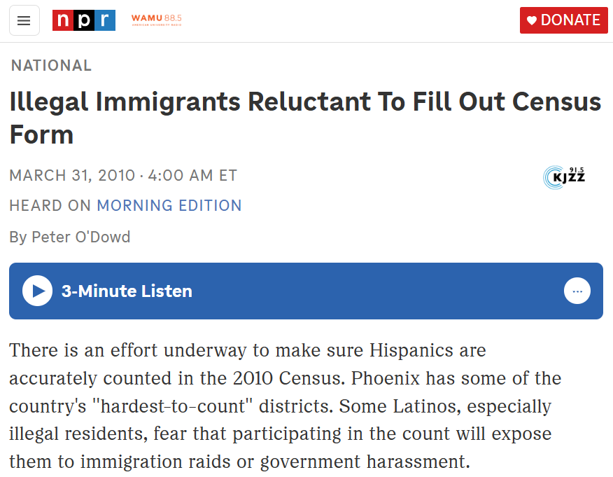
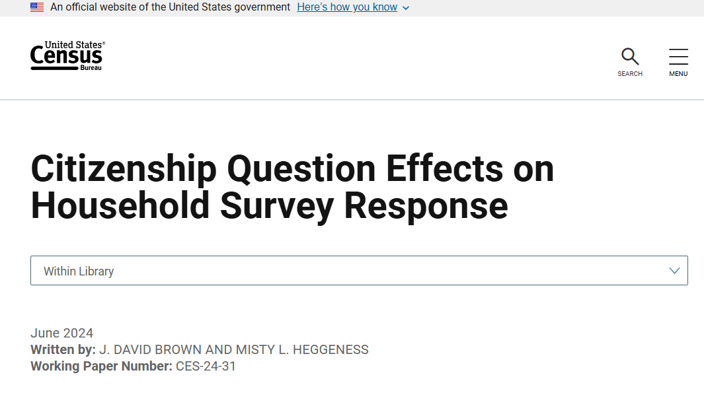
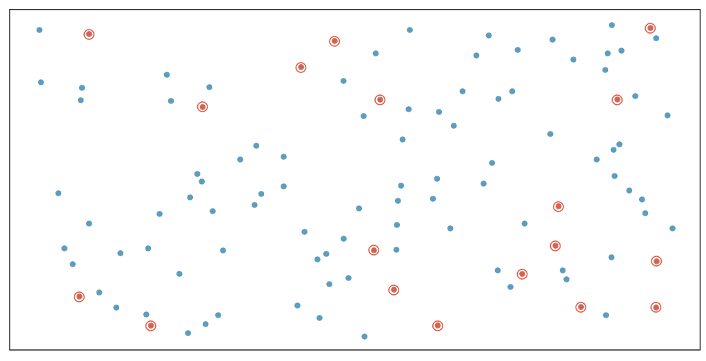
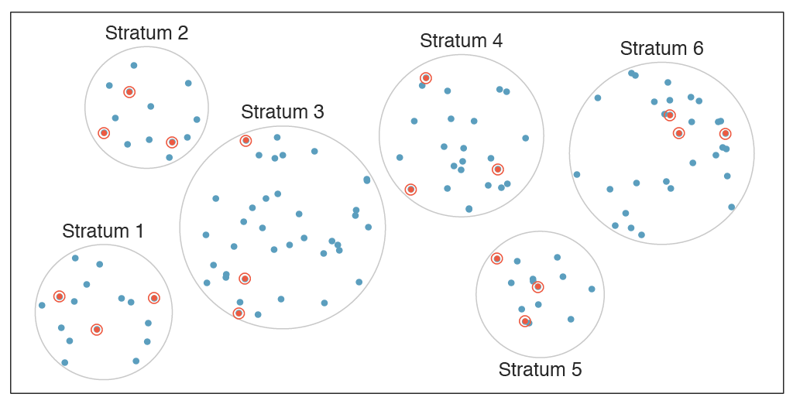
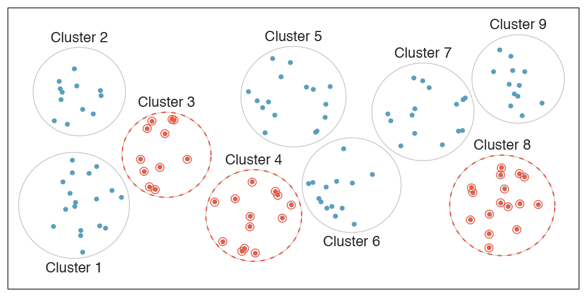
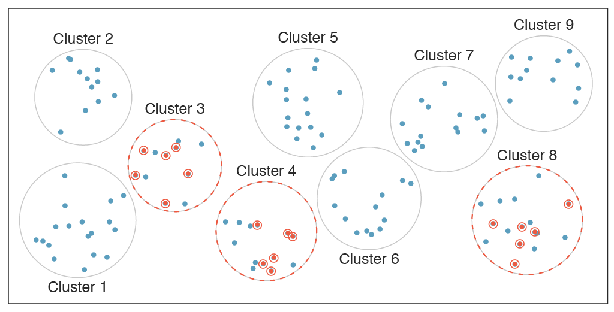
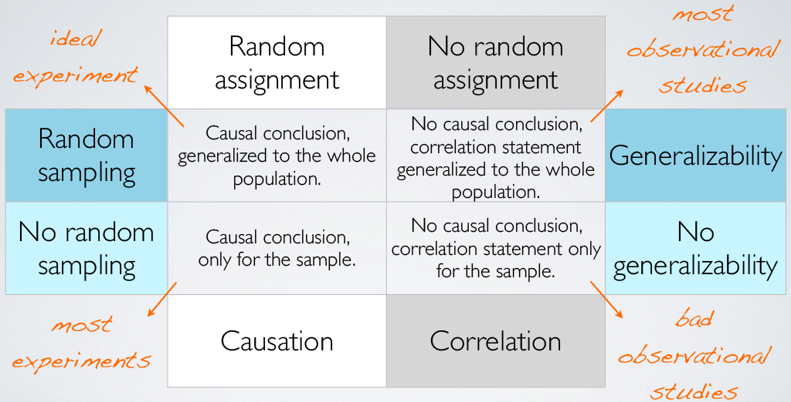

```{r setup, include=FALSE}
knitr::opts_chunk$set(echo = FALSE)
```

## Objectives

:::: {.column width=15%}
::::

:::: {.column width=70%}
- **Develop an understanding of sampling methods, bias, and anecdotal evidence**
- **Know how to differentiate observational and experimental studies, including their conclusions**
- **Introduce types statistical inference and various experimental designs**
::::

:::: {.column width=15%}
::::

## Relationship Among Variables

**Research Question:** Does there appear to be a relationship between the hours of study per week and the GPA of a student?

```{r gpa-vs-study-hours, echo=FALSE, fig.align='center', fig.cap="", message=FALSE, warning=FALSE, out.width='60%'}
library(openintro)
plot(gpa_study_hours$gpa ~ gpa_study_hours$study_hours, pch = 19, col = COL[1,3], xlab = "Hours of study / week", ylab = "GPA", cex.lab = 1.5, cex.axis = 1.5)
```

::: {style="color: red;"}
$\star$ As hours of study increases, the GPA also increases but for study hours around 0 to 30 hours, there is a lot of variation. There is one student with GPA > 4.0, this is likely a data error.
:::

## Explanatory vs Response Variables

* To identify the explanatory variable in a pair of variables, identify which of the two is suspected of affecting the other:

$$\text{explanatory variable} \xrightarrow{\text{might affect}} \text{response variable}$$

* Labeling variables as explanatory and response does not guarantee the relationship between the two is actually causal, even if there is an association identified between the two variables. We use these labels only to keep track of which variable we suspect affects the other.

## Associated vs Independent Variables

:::: {.column width=15%}
::::

:::: {.column width=70%}
* When two variables show some connection with one another, they are called <span style="color:blue">**associated**</span> variables.

* Associated variables can also be called <span style="color:blue">**dependent**</span> variables and vice-versa.

* If two variables are not associated, i.e. there is no evident connection between the two, then they are said to be <span style="color:blue">**independent**</span>.

* In general, <span style="color:blue">**association does not imply causation**</span>, and causation can only be inferred from a randomized experiment.
::::

:::: {.column width=15%}
::::

## Population vs Sample

**Research Question:** Can people become better, more efficient runners on their own, merely by running?

:::: {.column width=15%}
::::

:::: {.column width=70%}
* **Population of Interest:** All people
* **Sample:** Group of adult women who recently joined a running group
* **Population to which results can be generalized:** Adult women, if the data are randomly sampled.
::::

:::: {.column width=15%}
::::

::: {style="color: red;"}
$\star$ The random sample taken can only be generalized for adult women, not all people.
:::

## Anecdotal Evidence

**Research Question:** Can smoking contribute to negative health outcomes?

:::: {.column width=15%}
::::

:::: {.column width=70%}
* **Population of Interest:** All people
* **Sample:** A random person on the internet that said "My uncle smokes three packs a day and he's in perfectly good health".
* **Conclusion:** You may be compelled that smoking is fine.
::::

:::: {.column width=15%}
::::

::: {style="color: red;"}
$\star$ **Anecdotal evidence** refers to information or conclusions drawn from personal experiences, individual stories, or isolated examples rather than systematic data collection or rigorous scientific analysis.
:::

## Early Smoking Research

**Research Question:** Can smoking contribute to negative health outcomes?

:::: {.column width=15%}
::::

:::: {.column width=70%}
* Early anti-smoking research in the 1930s-40s faced resistance due to anecdotal evidence from individual cases.
* Smoking studies were challenging due to human variability and the complexity of behavior.
* Larger studies eventually revealed clear trends linking smoking to negative health effects.
::::

:::: {.column width=15%}
::::

::: {style="color: red;"}
$\star$ **Overgeneralization** is a logical fallacy where a conclusion is drawn from insufficient or unrepresentative evidence, applying it too broadly.
:::

## Census

**Wouldn't it be better to just include everyone and "sample" the entire population?**

:::: {.column width=49%}
This is called a **Census**.

* A census is a systematic count of a population. 
* It collects detailed information about individuals and households. 
* Censuses are usually carried out at regular intervals and are used for policy-making, resource allocation, and demographic analysis.
* The purpose of the census is to have fair political representation, helping researchers and businesses to make people's lives better.
::::

:::: {.column width=50%}
**Problems with taking a census:**

* Some people are hard to find or measure, often due to unique characteristics.
* Populations also change constantly, making a perfect count impossible.
* In some cases, a full census can be more complicated than sampling.
* **Sampling bias** introduces a lot of problems and consequences.
::::

## Sampling Bias (1/3)

**What is sampling bias?** It occurs when the sample collected for a study or survey is not representative of the larger population that the study aims to analyze.

There are several ways sampling bias can occur, such as:

:::: {.column width=10%}
::::

:::: {.column width=80%}
* **Non-random sampling:** If the method used to select the sample is not random or systematic, certain groups might have a higher chance of being included.
* **Self-selection bias (voluntary response):** When individuals choose themselves to participate (e.g., in online surveys), the sample may include only those with specific characteristics or strong opinions.
* **Convenience sample (exclusion bias):** This happens when some segments of the population are systematically excluded from the sampling process, even unintentionally. Individuals who are easily accessible are more likely to be included in the sample.
::::

:::: {.column width=10%}
::::

## Sampling Bias (2/3)

:::: {.column width=54%}
```{r npr-2020-census-illegal-immigration, echo=FALSE, fig.cap="", fig.align='center', out.width = '100%'}

```

[NPR: Illegal Immigrants Reluctant to Fill Out Census Form](https://www.npr.org/2010/03/31/125380052/illegal-immigrants-reluctant-to-fill-out-census-form){target="_blank"}
::::

:::: {.column width=45%}
```{r npr-200-years-of-citizenship-question, echo=FALSE, fig.cap="", fig.align='center', out.width = '100%'}
knitr::include_graphics("npr-200-years-of-citizenship-question.png")
```

[NPR: See 200 Years Of Twists And Turns Of Census Citizenship Questions](https://www.npr.org/2019/04/23/630562915/see-200-years-of-twists-and-turns-of-census-citizenship-questions){target="_blank"}
::::

## Sampling Bias (3/3)

:::: {.column width=45%}
```{r us-census-citizenship-question-effects, echo=FALSE, fig.cap="", fig.align='center', out.width = '100%'}

```

[US Census: Citizenship Question Effects on Household Survey Response](https://www.census.gov/library/working-papers/2024/adrm/CES-WP-24-31.html){target="_blank"}
::::

:::: {.column width=54%}
* **Impact on the Census:** 

- Undocumented immigrants may avoid the census due to fear of deportation or mistrust of the government.
- Controversies surrounding the inclusion of citizenship questions in recent censuses and their impact on data collection and representation.
    
* **Consequences:**

- This lead to an undercount --for both documented and undocumented immigrants-- which leads to inaccurate demographic data.
::::

## Exploratory Analysis to Inference

**What is Exploratory Analysis?** It is the process of analyzing and summarizing datasets to uncover patterns, trends, relationships, and anomalies before inference.

:::: {.column width=15%}
::::

:::: {.column width=70%}
* Sampling is natural.
* Think about sampling something you are cooking - you taste (*examine*) a small part of what you're cooking to get an idea about the dish as a whole.
* When you taste a spoonful of soup and decide the spoonful you tasted isn't salty enough, that's **exploratory analysis**.
* If you generalize and conclude that your entire soup needs salt, that's an **inference**.
::::

:::: {.column width=15%}
::::

## Inference

**What is inference?** It is the process of drawing conclusions about a population based on sample data. This involves using data from a sample to make generalizations, predictions, or decisions about a larger group.

:::: {.column width=15%}
::::

:::: {.column width=70%}
* For your inference to be valid, the spoonful you tasted (the **sample**) needs to be **representative** of the entire pot (the **population**).
* If your spoonful comes only from the surface and the salt is collected at the bottom of the pot (**sampling bias**), what you tasted is probably not representative of the whole pot.
* If you first stir the soup thoroughly before you taste (**random sampling**), your spoonful will more likely be representative of the whole pot.
::::

:::: {.column width=15%}
::::

## Types of Inference

|  | **Parameter Estimation** | **Hypothesis Testing** |
|:---|:------|:------|
| _Goal_ | Estimate an unknown population value | Assess claims about a population value |
| _Methods_ | Point Estimation: A single value estimate (e.g., sample mean) <br>Interval Estimation: A range of plausible values (e.g., confidence interval) | State a null and an alternative hypothesis <br>Compute a test statistic and compare it to a threshold (p-value or critical value) |
| _Key Concept_ | Focuses on precision in estimation (confidence intervals) | Focuses on decision-making based on evidence (reject or fail to reject the null hypothesis) |

::: {style="color: red;"}
$\star$ Parameter estimation focuses on finding the best estimate of an unknown population value, while hypothesis testing determines whether there is enough evidence to support or reject a claim about the population.
:::

## Obtaining Good Samples

:::: {.column width=15%}
::::

:::: {.column width=70%}
* Almost all statistical methods are based on the notion of implied randomness.

* Most commonly used random sampling techniques are **simple**, **stratified**, and **cluster** sampling.
::::

:::: {.column width=15%}
::::

## Simple Random Sample

**What is simple random sampling?** Randomly select cases from the population, where there is no implied connection between the points that are selected.

```{r simple-diagram, echo=FALSE, fig.cap="", fig.align='center', out.width = '80%'}

```

## Stratified Sample

**What is stratified sampling?** **Strata** are made up of similar observations. We take a simple random sample from each stratum.

```{r stratified-diagram, echo=FALSE, fig.cap="", fig.align='center', out.width = '80%'}

```

## Cluster Sample

**What is cluster sampling?** **Clusters** are usually not made up of homogeneous observations. We take a simple random sample of clusters, and then sample all observations in that cluster.

```{r cluster-diagram, echo=FALSE, fig.cap="", fig.align='center', out.width = '80%'}

```

## Multistage Sample

**What is multistage sampling?** Clusters are usually not made up of homogeneous observations. We take a simple random sample of clusters, and then take a simple random sample of observations from the sampled clusters.

```{r multistage-diagram, echo=FALSE, fig.cap="", fig.align='center', out.width = '80%'}

```

## Statified vs Clustered Sampling

**Scenario:** A hospital wants to survey nurse job satisfaction across departments.

| **Sampling Method** | **Process** | **Example** |
|:---|:---------|:------|
| *Stratified* | Divide nurses into departments (strata) and sample proportionally from each group. | 8 emergency, 6 ICU, 10 pediatrics, 16 general medicine |
| *Clustered* | Divide hospital into floors (clusters) and randomly select entire floors, surveying all nurses there. | Select 2 random floors and survey all nurses on those floors. |

::: {style="color: red;"}
$\star$ Stratified sampling ensures proportional representation from all departments, while clustered sampling is more practical but may miss some groups.
:::

## Types of Studies

| **Observational** | **Experimental** |
|:---|:---|
| Researchers <span style="color:blue">**observe**</span> subjects without interference. | Researchers <span style="color:blue">**intervene**</span> by applying treatments to subjects. |
| No treatment or manipulation is imposed. |  Includes a <span style="color:blue">**control**</span> and <span style="color:blue">**treatment**</span> groups with random assignments (ideally). |
| Used to find <span style="color:blue">**associations**</span>, not causation. | Can determine <span style="color:blue">**causal relationships**</span>. |
| 

::: {style="color: red;"}
$\star$ Observational studies find patterns, while experimental studies test cause-and-effect.
:::

## Smoking and Lung Cancer

**Research Question:** Is there a relationship between smoking and lung cancer?

:::: {.column width=49%}
**Study Design:**

* Researchers select smoker and non-smoker group (or *cohorts*).
* They *observe* these participants over a long period (e.g., 20 years) *without influencing their smoking habits.*
::::

:::: {.column width=50%}
**Findings:** 

* Periodically, they record lung cancer incidence in both groups.
* If lung cancer occurs more frequently in smokers than non-smokers, researchers may conclude that *smoking is associated with an increased risk of lung cancer*.
::::

::: {style="color: red;"}
$\star$ Since this is **observational**, it cannot prove smoking causes lung cancer --other factors (e.g., genetics, pollution) may also contribute. **However, strong correlations from multiple studies can strengthen this conclusion.**
:::

## Types of Observational Studies

| **Aspect** | **Case-Control** | **Cohort (Longitudinal)** | **Cross-Sectional** |
|:---|:------|:------|:------|
| _Study Design_ | Compares individuals with a condition (cases) to those without (controls). | Follows groups of individuals over time, observing exposures and outcomes. | Measures a population at a single point in time, observing various variables. |
| _Main Focus_ | Identifying exposures or risk factors associated with an outcome. | Observing how exposures lead to outcomes over time. | Examining the prevalence of variables or conditions at a given time. |
| _Temporal Sequence_ | <span style="color:blue">**Retrospective**</span> --looks back in time to find past exposures. | <span style="color:blue">**Prospective**</span> --follows participants forward in time. | No temporal sequence – snapshot of a population at a single time point. |
| _Data Collection_ | Collects past data (often using medical records or interviews). | Collects data over time, often requiring repeated observations or surveys. | Collects data at one point in time. |

::: {style="color: red;"}
$\star$ Case-Control looks at data in the past, Cohort follows the data, and Cross-Sectional looks at data at one point in time.
:::

## Strengths and Limitations of Observational Studies

| **Aspect** | **Case-Control** | **Cohort (Longitudinal)** | **Cross-Sectional** |
|:---|:------|:------|:------|
| _Strengths_ | Good for studying rare diseases, cost-effective, relatively quick. | Can establish temporal relationships, good for studying causes and effects. | Quick, inexpensive, good for identifying associations. |
| _Limitations_ | Cannot establish causality, relies on recall bias. | Expensive, time-consuming, and prone to participant attrition. | Cannot determine causality, only associations. |

::: {style="color: red;"}
$\star$ The limitation of observational studies is that it can not determine causality, only associations.
:::

## Prospective vs Retrospective Observational Studies

| **Study Type** | **Description** | **Strengths** | **Limitations** |
|:---|:------|:------|:------|
| **Prospective Study** | Researchers follow subjects forward in time, starting with an exposure and observing future outcomes. | Can establish a temporal relationship between exposure and outcome, reduces recall bias. | Expensive, time-consuming, potential participant dropout. |
| **Retrospective Study** | Researchers analyze past data, identifying subjects with an outcome and looking back to determine exposure. | Quick, cost-effective, useful for rare diseases or long-term effects. | Prone to recall bias, missing or incomplete data, cannot establish causality. |

::: {style="color: red;"}
$\star$ Prospective means present and future data and retrospective means the past data.
:::

## Hypertension and Stroke Incidence

**Research Question:** Is there a relationship between hypertension and stroke incidence in an older population?

:::: {.column width=49%}
**Study Design:**

* The cases are patients aged 50+ with medical records from the past 10 years.
* Medical records are used from a hospital database, tracking blood pressure levels and stroke incidence.
* Two groups are identified based on hypertension diagnosis: hypertensive and non-hypertensive groups.
::::

:::: {.column width=50%}
**Findings:** 

* Review medical records to determine how many individuals from each group experienced a stroke within the 10-year period.
* The hypertensive group showed a significantly higher incidence of stroke compared to the non-hypertensive group.
::::

::: {style="color: red;"}
$\star$ This is an example of a retrospective cohort Study because the data is in the past and the design involves groups.
:::

## Energy Gels

**Research Question:** Does energy gels make a person run faster?

:::: {.column width=49%}
**Study Design:**

* Participants are grouped into *treatment* (with energy gel) and *control* (without energy gel).
* Record the participants time lapses.
::::

:::: {.column width=50%}
**Findings:** 

* It is suspected that energy gels might affect pro and amateur athletes.
* The analysis is weak or inconclusive since there were confounding variables unaccounted such as pro vs amateur athletes.
::::

::: {style="color: red;"}
$\star$ This is an example of an experimental study because the design involves an intervention, which is the treatment group (with intervention) and compared it to the control group (without intervention).
:::

## Blocking

Since it is suspected that energy gels might affect pro and amateur athletes differently, we <span style="color:blue">**block**</span> for pro status.

:::: {.column width=49%}
**Study Design:**

* Divide the sample to *pro* and *amateur*
* Randomly assign pro athletes to *treatment* and *control* groups
* *Randomly assign* amateur athletes to treatment and control groups
::::

:::: {.column width=50%}
**Findings:** 

* Pro/amateur status is *equally represented* in the resulting treatment and control groups
* The analysis is stronger and they found that energy gels can provide a quick energy boost and therefore can make a person run faster.
::::

::: {style="color: blue;"}
$\dagger$ Why is is blocking important? Can you think of other variables to block for?
:::

::: {style="color: red;"}
$\star$ Since this is an experimental study, we can conclude a causal relationship between use of energy gels and faster running.
:::

## Principles of Experimental Design

| **Principle** | **Description** |
|:---|:------|
| **Control** | Compare treatment of interest to a control group. |
| **Randomize** | Randomly assign subjects to treatments, and randomly sample from the population whenever possible. |
| **Replicate** | Within a study, replicate by collecting a sufficiently large sample. Or replicate the entire study. |
| **Block** | If there are variables that are known or suspected to affect the response variable, first group subjects into blocks based on these variables, and then randomize cases within each block to treatment groups. |

::: {style="color: red;"}
$\star$ Experimental studies establish a cause-and-effect relationship by manipulating independent variables and observing their impact on dependent variables while controlling for confounding factors.
:::

## Blocking vs Explanatory Variables

| **Aspect** | **Blocking** | **Explanatory** |
|:---|:------|:------|
| _Definition_ | Characteristics that experimental units come with and that we want to control for. | Variables that we manipulate or observe to explain the outcome of the experiment. |
| _Purpose_ | Used to reduce variability by grouping experimental units with similar traits. | Used to explore or test the effect of a treatment or intervention on outcomes. |
| _Role in Experiment_ | Serve as a way to control for potential confounders and reduce bias. | Act as the independent variable(s) whose effect on the dependent variable is tested. |
| _Timing in Experiment_ | Applied before random assignment to ensure balanced groups. | Manipulated or measured during the experiment to observe their effect. |

::: {style="color: red;"}
$\star$ Explanatory variables are factors tested for their impact, while blocking groups subjects to reduce confounding effects.
:::

## More Experimental Design Terminology

* **Placebo:** Fake treatment, often used as the control group in medical studies.
* **Placebo Effect:** Improvement observed in experimental units simply because they believe they are receiving special treatment.
* **Blinding:**	When experimental units do not know whether they are in the control or treatment group.
* **Double-Blind:**	When both the experimental units and the researchers interacting with them do not know who is in the control or treatment group.

## Random Assignment vs Random Sampling

```{r random-sample-assignment, echo=FALSE, fig.cap="", fig.align='center', out.width = '90%'}

```
