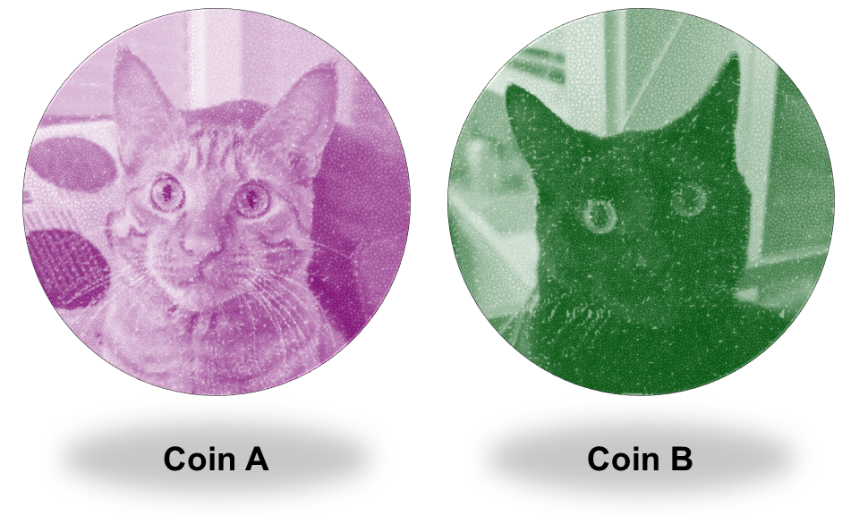
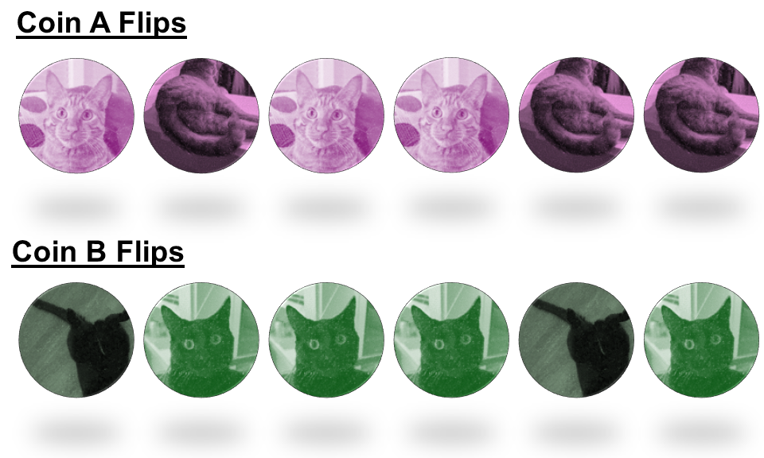
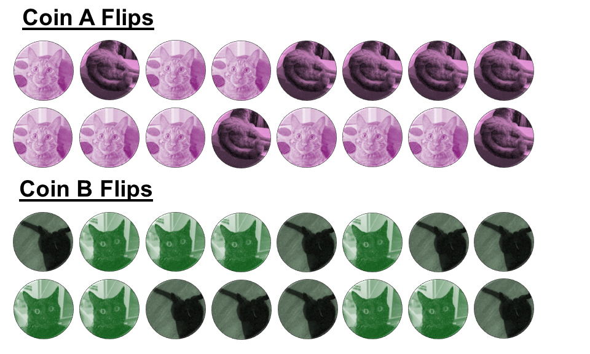
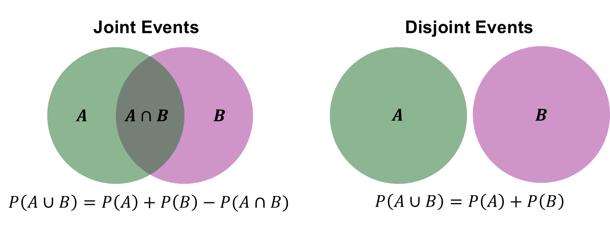
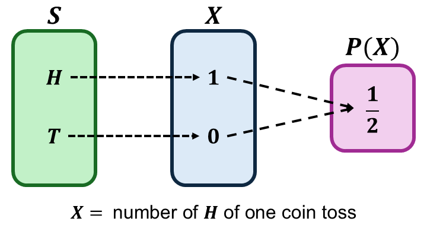
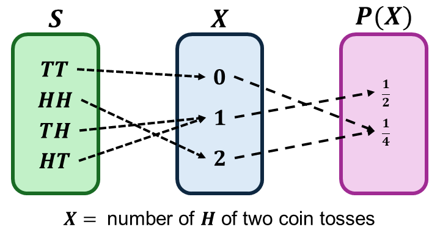
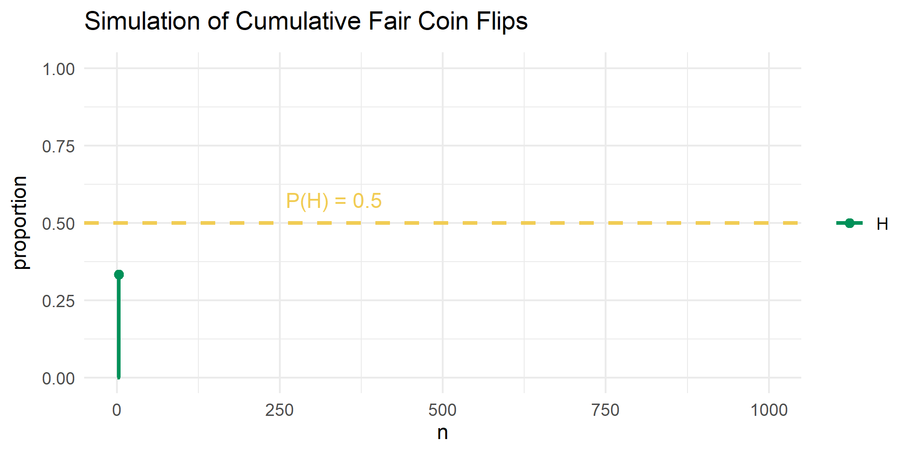

```{r setup, include=FALSE}
knitr::opts_chunk$set(echo = FALSE)
```

```{r echo=FALSE, eval=TRUE,message=FALSE, warning=FALSE}
library(tidyverse)
library(openintro)
library(kableExtra)
library(sn)
data(COL)
seed <- 42
```

## Objectives

:::: {.column width=15%}
::::

:::: {.column width=70%}
- **Develop an understanding of the sample space, events, and random variables**
- **Know how to compute basic probabilities using probability rules**
- **Introduce the axioms of probability and probability functions**
::::

:::: {.column width=15%}
::::

## Toy Example

**Suppose you have two coins. Which of the two coins are fair?**

```{r coin, echo=FALSE, fig.cap="", fig.align='center', out.width = '30%'}

```

**What is a fair coin?** There are only *two possible outcomes* of each coin: *head* or *tail*, but not both. A fair coin means that if you flip it, the *chances* of getting a head or tail is *equally likely*.

::: {style="color: blue;"}
$\dagger$ How would you know which coin is fair if they are "similar" in appearance and weight?
:::

## Sampling

**Flip the coin $6$ times.**

:::: {.column width=49%}
**Data:**

```{r coin-flips, echo=FALSE, fig.cap="", fig.align='center', out.width = '100%'}

```
::::

:::: {.column width=50%}
**Sample Proportion of Heads:**

* *Coin A:* $\frac{3}{6} = 0.50$.
* *Coin B:* $\frac{4}{6} \approx 0.667$.
::::

::: {style="color: blue;"}
$\dagger$ If we flip the coins more and add it into the totals, will the proportion of heads change?
:::

## True vs Sample Proportion

**Flip the coin $16$ times.**

:::: {.column width=49%}
**Data:**

```{r coin-flips-more, echo=FALSE, fig.cap="", fig.align='center', out.width = '100%'}

```
::::

:::: {.column width=50%}
**Sample Proportion of Heads:**

* *Coin A:* $\frac{9}{16} \approx 0.563$.
* *Coin B:* $\frac{8}{16} = 0.50$.

**True Proportion of Heads:** We don't know the true proportion of heads for each coin or which one is fair, but we know a fair coin should yield a $0.50$ proportion of heads.
::::

::: {style="color: red;"}
$\star$ **Key Idea:** The goal of parameter estimation is to determine the true proportion of heads for coins A and B, accounting for uncertainty from random sampling (coin flips).
:::

::: {style="color: blue;"}
$\dagger$ How many coin flips should you do until you are certain which one is the fair coin?
:::

## Probability is the Basis for Inference

* **Probability** provides a framework for drawing conclusions about a population from a sample.
* It helps **quantify uncertainty in estimates and decisions**.
    - Sampling distributions: Describe how statistics (e.g., sample mean) behave over repeated samples.
    - Law of Large Numbers (LLN): Guarantees that sample estimates converge to the true population value as sample size increases.
    - Central Limit Theorem (CLT): States that the sampling distribution of the sample mean approaches normality for large sample sizes, regardless of the population distribution.

::: {style="color: red;"}
$\star$ Probability bridges the gap between sample data and population conclusions.
:::

## Toy Example: Which of the two coins are fair?

Once we estimate the true proportion of heads, we can test which coin is fair through hypothesis testing. We can frame the test in two ways:

:::: {.column width=49%}
**Way 1**

* *Null hypothesis:* The true proportion of heads of coin B (or A) is $0.50$.
* *Alternative hypothesis:* the true proportion of heads of coin B (or A) is not $0.50$.
::::

:::: {.column width=50%}
**Way 2:**

* *Null Hypothesis:* The true proportion of heads of coin A is equal to coin B.
* *Alternative Hypothesis:* The true proportion of heads of coin A is not equal to coin B
:::

::: {style="color: red;"}
$\star$ **Key Idea:** Hypothesis testing involves two opposing statements: the null hypothesis and the alternative hypothesis, which we aim to test.
:::

## The P-Value is a Probability

* The **p-value** measures the **strength of evidence against the null hypothesis**.
* It represents the probability of observing data as extreme (or more extreme) than the sample data, assuming the null hypothesis is true.
* Interpretation:
    - *Small p-value:* Strong evidence against the null hypothesis.
    - *Large p-value:* Insufficient evidence to reject the null hypothesis.
* The p-value does *not* measure:
    - The probability that the null hypothesis is true.
    - The magnitude of an effect.

::: {style="color: red;"}
$\star$ The p-value quantifies how surprising the sample data is under the assumption that the null hypothesis is true.
:::

## Probability and Statistics

:::: {.column width=49%}
**Probability**

  * A measure on how likely an event occurs
  * Computing probabilities have specific rules
  * Logical reasoning
  * One answer
::::

:::: {.column width=50%}
**Statistics**

  * It's an art and science
  * Collecting, analyzing, interpreting, and presenting data
  * Data-driven approach to make conclusions and prediction
  * Multiple ways to solve problems
::::

## Basic Probability Definition

**Probability** is the branch of mathematics that deals with randomness. The *likelihood* of an outcome happening.

An extent to which an outcome is likely to occur is $$\text{probability} = \frac{\text{number of favorable outcomes}}{\text{total number of outcomes}}.$$

## Coin

* *Possible outcomes:* $H$ or $T$ ($H$ for heads, $T$ for tails)
* *Total number of possible outcomes:* $2$
* *Probabilities:*
\[
\begin{aligned}
\text{probability of } H & = \frac{1}{2} \\
\text{probability of } T & = \frac{1}{2}
\end{aligned}
\]

## Dice

* *Possible outcomes:* 1 (&#9856;), 2 (&#9857;), 3 (&#9858;), 4 (&#9859;), 5 (&#9860;), or 6 (&#9861;)
* *Total number of possible outcomes:* $6$
* *Probabilities:*
\[
\begin{aligned}
\text{probability of } 1 & = \frac{1}{6} & \text{probability of } 4 & = \frac{1}{6} \\
\text{probability of } 2 & = \frac{1}{6} & \text{probability of } 5 & = \frac{1}{6} \\
\text{probability of } 3 & = \frac{1}{6} & \text{probability of } 6 & = \frac{1}{6}
\end{aligned}
\]

## Standard Deck of Cards

**52-Card Deck** 

* *Possible outcomes:* The four suits are Hearts (♥), Diamonds (♦), Clubs (♣), Spades (♠). Each suit has 13 ranks: Ace (A), 2, 3, 4, 5, 6, 7, 8, 9, 10, Jack (J), Queen (Q), and King (K).
* *Total number of possible outcomes:* $52$
* *Probabilities:*
\[
\text{probability of Q of Hearts } = \frac{1}{52}
\]
Actually, the probability of any card drawn once is $\frac{1}{52}$.

## Probability Notations (1/2)

We will use **specific words** for outcomes.

* A set of possible outcomes is called the **sample space**.
* Any subset of $S$ are called **events**.
* An **event space** is a set all subsets of outcomes of the sample space.

**Fair Coin Example:**

* Sample space: $S = \{H,T\}$
* Events space: $\{H\}$, $\{T\}$, $\{H,T\}$, $\emptyset$
* Two events from $S$: $\{H\}$ and $\{T\}$

## Probability Notations (2/2)

We will use **specific notations** for probabilities.

Let $A$ be an event with a finite sample space $S$. The probability of $A$ is $$P(A) = \frac{|A|}{|S|} \longrightarrow P(A) = \frac{\text{number of outcome favorable to } A}{\text{total number of outcomes in } S}.$$

**Fair Coin Example:**

\[
\begin{aligned}
\text{probability of } H & = \frac{1}{2} \longrightarrow P(H) = \frac{1}{2} \\
\text{probability of } T & = \frac{1}{2} \longrightarrow P(T) = \frac{1}{2}
\end{aligned}
\]
    
## Set Notation

Suppose we have **events** A and B:

* **$\cap$ means “intersection”**

"$A \cap B$" is the set of all objects in A **AND** B
  
* **$\cup$ means "union"**

"$A \cup B$" is the set of all objects in A **OR** B.

## Independence

Two events, $A$ and $B$, are **independent** if the **occurrence of one does not affect the probability of the other**: $$P(A \cap B) = P(A)P(B)$$

If the event $B$ is **dependent** on $A$, then $$P(A \cap B) \ne P(A)P(B)$$

::: {style="color: red;"}
$\star$ Independent events is when one event happening does not affect the other. Disjoint events is when one event happening prevents the other.
:::

## Coin Flips

Suppose we conduct an experiment of flipping fair coins in sequence and record the outcomes.

* One Coin: $H$ or $T$ (two possible outcomes)
  - $P(H) = \frac{1}{2}$ and $P(T) = \frac{1}{2}$ but $P(H \text{ and } T) = 0$ because they can't occur simultaneously

* Two Coins: $HH$, $HT$, $TH$, or $TT$ (four possible outcomes)
  - $P(H \cap H) = P(H)P(H) = \left( \frac{1}{2} \right) \left( \frac{1}{2} \right) = \left( \frac{1}{4} \right)$ because each flip is independent
  - $P(H \cap T) = P(H)P(T) = \left( \frac{1}{2} \right) \left( \frac{1}{2} \right) = \left( \frac{1}{4} \right)$
  - $P(T \cap H) = P(T)P(H) = \left( \frac{1}{2} \right) \left( \frac{1}{2} \right) = \left( \frac{1}{4} \right)$
  - $P(T \cap T) = P(T)P(T) = \left( \frac{1}{2} \right) \left( \frac{1}{2} \right) = \left( \frac{1}{4} \right)$

## Disjoint and Joint Events

Two events, $A$ and $B$, are **disjoint** (or **mutually exclusive**) if they **cannot occur at the same time**: $$P(A \cap B) = 0.$$

Two event, $A$ and $B$ are **joint** if they can happen together: $$P(A \text{ and } B) \ne 0$$

**Fair Coin Example:**

* $S = \{H,T\}$
* $P(H \cap T) = 0$ since $H$ and $T$ outcomes cannot occur simultaneously in one flip

## Union of Events

The **union** of two events, $A$ and $B$, is the **event that at least one of them occurs**: $$P(A \cup B) = P(A) + P(B) - P(A \cap B)$$

If $A$ and $B$ are disjoint, then $$P(A \cup B) = P(A) + P(B)$$

::: {style="color: red;"}
$\star$ The probability of the union is the sum of individual probabilities minus their intersection (to avoid double-counting).
:::

## Joint vs Disjoint Venn Diagram

```{r join-disjoint-venn-diagram, echo=FALSE, fig.cap="", out.width="90%", fig.align="center"}

```

## Drawing Cards

Suppose we conduct an experiment of drawing specific characteristics of a card from a 52-card deck.

* Let $A$ be the event that we draw a Queen.
* Let $B$ be the event that we draw a Heart.
* Events $A$ and $B$ are joint.
    - $P(A \cap B) = \frac{1}{52}$ (Queen of Hearts).
* We know that there are 4 Queens and 13 Hearts.
    - $P(A) = \frac{4}{52}$, $P(B) = \frac{13}{52}$, and 
    - $P(A \cup B) = P(A) + P(B) - P(A \cap B) = \frac{4}{52} + \frac{13}{52} - \frac{1}{52} = \frac{16}{52}$

## Dice Rolls

Suppose we conduct an experiment of rolling two six-sided dice and sum the outcomes.

* Each dice has six outcomes: 1 (&#9856;), 2 (&#9857;), 3 (&#9858;), 4 (&#9859;), 5 (&#9860;), or 6 (&#9861;)
* Let $A$ be the event of the 1st dice.
* Let $B$ be the event of the 2nd dice.
* The outcome we are interested in is the sum of $A$ and $B$. So, the sample space has 36 total possible outcomes.
    - The probability of getting a sum of 3 is $$\begin{aligned} P(3) & = P(1 \cap 2) + P(2 \cap 1) \\ & = P(1)P(2) + P(2)P(1) \\ & = \left( \frac{1}{6} \right) \left( \frac{1}{6} \right) + \left( \frac{1}{6} \right) \left( \frac{1}{6} \right) \\ & = 2 \times \left( \frac{1}{6} \right) \left( \frac{1}{6} \right) \\ & = \frac{2}{36} \end{aligned}$$ because of independence and joint events.

## Basic Probability Rules

| **Rule** | **Formula** |
|:---|:------|
| *Independence* | $P(A \cap B) = P(A)P(B)$ |
| *Joint (Union)* | $P(A \cup B) = P(A) + P(B) - P(A \cap B)$ |
| *Disjoint* | $P(A \cap B) = 0$ |
| *Complement* | If $P(A) + P(B) = 1$, then $1-P(A)=P(B)$. |

## Probability Axioms

| **Axiom** | **Statement** |
|:---|:------|
| $P(S) = 1$ | The sum of the probabilities for all outcomes in the sample space is equal to 1. |
| $P \in [0,1]$ | Probabilities are always positive and always between $0$ and $1$. |
| $P(A \cup B) = P(A) + P(B)$ | If events A and B are disjoint (mutually exclusive), then their probabilities can be added. |

## Random Variables

A **random variable (r.v.)** is a numerical outcome of a random experiment. It assigns a number to each possible outcome in a sample space.

In other words, a random variable is **a function that maps the sample space into real numbers**.

**Types:**

* *Discrete Random Variable:* Takes on a countable number of outcomes
* *Continuous Random Variable:* Takes on any value of outcomes in an interval

::: {style="color: red;"}
$\star$ R.v.s provides a way to assign numerical values to outcomes in a sample space, allowing us to analyze and compute probabilities in a structured manner
:::

## Probability Functions

A **probability function** assigns probabilities to outcomes in a sample space.

In other words, a probability function **maps the r.v. into the the real numbers between 0 and 1**.

**Types:**

* *Probability Mass Function (PMF):* PMFs are for discrete random variables
* *Probability Density Functions (PDF):* PDFs are for continuous random variables

::: {style="color: red;"}
$\star$ We can define a probability function directly from the sample space, but using a random variable makes it explicit what outcomes we want to compute probabilities for in a given scenario.
:::

## Flipping One Coin R.V.

Suppose we conduct an experiment of flipping a fair coin once.

:::: {.column width=49%}
* Let $S = \{H,T\}$ be the sample space.
* Let $X$ be the r.v. that counts the number of $H$ outcomes.
* The r.v. is given by
\[
\begin{aligned}
X(H) & = 1 \\
X(T) & = 0 \\
\end{aligned}
\]
::::

:::: {.column width=50%}
```{r one-coin-toss-rv, echo=FALSE, fig.cap="", out.width="95%", fig.align="center"}

```
::::

::: {style="color: red;"}
$\star$ A random variable for a coin toss maps the sample space $\{H,T\}$ to real values, assigning $X(H)=1$ and $X(T)=0$. The probability function $P(X)$ then defines the probability space.
:::

## Flipping Two Coins R.V.

Suppose we conduct an experiment of flipping two fair coins in a sequence.

:::: {.column width=49%}
* We know that one coin has two possible outcomes $\{H,T\}$.
* Let $S = \{TT,TH,HT,TT\}$ be the sample space.
* Let $X$ be the r.v. that counts the number of $H$ outcomes.
* The r.v. is given by
\[
\begin{aligned}
X(TT) = 0 & & X(TH) = 1 \\
X(HT) = 1 & & X(HH) = 2 \\
\end{aligned}
\]
::::

:::: {.column width=50%}
```{r two-coin-toss-rv, echo=FALSE, fig.cap="", out.width="95%", fig.align="center"}

```
::::

::: {style="color: red;"}
$\star$ The PMF $P(X)$ satisfies the probability axioms, and the collection of all probabilities forms the probability distribution.
:::

## Interpreting Probability

**Frequentist probability** refers to the interpretation of probability based on the long-run frequency of an event occurring in repeated trials or experiments.

**Coin Flipping Example**

Suppose we conduct an experiment where we repeatedly flip a fair coin ($P(H) = 0.50$), tracking the cumulative count of $H$ and its proportion after each flip.

```{r echo=FALSE, eval=TRUE, fig.align='center', out.width='70%', message=FALSE, warning=FALSE}

```

::: {style="color: red;"}
$\star$ As the number of flips (samples) increases the proportion of H gets closer and closer to the true proportion of H, which is $P(H)=0.50$.
:::
