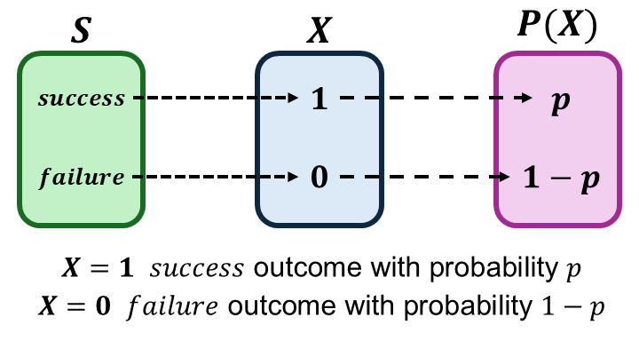

```{r setup, include=FALSE}
knitr::opts_chunk$set(echo = FALSE)
```

```{r echo=FALSE, eval=TRUE,message=FALSE, warning=FALSE}
library(tidyverse)
library(openintro)
data(COL)
seed <- 42
```

## Objectives

:::: {.column width=15%}
::::
 
:::: {.column width=70%}
- **Introduce the expected value and variance**
- **Know how to compute the expected value of a random variable**
- **Develop an understanding of variance in terms of the expected value**
::::

:::: {.column width=15%}
::::

## R.V. of Binary Outcomes

Suppose we conduct an experiment of one randomized outcome from a binary r.v..

A **binary r.v.** $X$ is a variable that takes only two possible values, typically labelled as "success" and "failure".

:::: {.column width=49%}
* Let $S = \{\text{success},\text{failure}\}$ be the sample space.
* The r.v. is given by
\[
\begin{aligned}
X(\text{success}) & = 1 \\
X(\text{failure}) & = 0 \\
\end{aligned}
\]
::::

:::: {.column width=50%}
```{r binary-rv, echo=FALSE, fig.cap="", out.width="95%", fig.align="center"}

```
::::

::: {style="color: red;"}
$\star$ An r.v. with binary outcome is called the **Bernoulli R.V.** with a probability of "success" $p$ and "failure" $1-p$, where $p$ is called the *parameter*. One trial with binary outcomes is called a **Bernoulli trial**.
:::

## The Bernoulli R.V.

A **Bernoulli r.v.** represents a single experiment with two possible outcomes: "success" ($X=1$) with probability $p$ and failure ($X=0$) with probability $1-p$. We typically define an r.v. using $\sim$ along with the name and its parameter: $$X \sim \text{Bern}(p)$$

The **Bernoulli distribution** is a **probability mass function** (PMF) that computes the probability of the Bernoulli r.v..

$$
P(X = x) = 
\begin{cases}
p & \text{, if } x = 1 \\
1-p & \text{, if } x = 0
\end{cases}.
$$

where $p$ is the parameter (also the probability of "success").

The above function can also be written as

$$P(X = x) = p^x (1-p)^{1-x}, \ \ x \in \{0,1\}.$$

## The Bernoulli R.V.: Flipping a Fair Coin

Suppose we conduct an experiment of flipping a fair coin once.

This scenario can be modeled using the Bernoulli R.V. with parameter $p=\frac{1}{2}$ because the probability of "success" is $\frac{1}{2}$.

Here, we define a "success" of the r.v. to be the $H$ outcome: $$X \sim \text{Bern}\left(\frac{1}{2}\right)$$ with PMF defined as $$P(X=x) = \left(\frac{1}{2}\right)^x \left(1-\frac{1}{2}\right)^{1-x}, \ \ x \in \{0,1\}.$$

::: {style="color: red;"}
$\star$ Any scenario for one experiment with binary outcomes can be modeled using the Bernoulli r.v..
:::

## The Expected Value for the Discrete R.V.

The **expected value** of a r.v. is the weighted mean (average) of all possible values that the variable can take, weighted by their probabilities. It represents the long-run average outcome of a random experiment.

**Discrete R.V.**

For a discrete r.v. $X$, the **expected value (or expectation)** is given by $$\text{E}(X) = \sum_{i=1}^{n} x_i P(X = x_i)$$ where:

* $x_1, x_2, \dots, x_n$ are the $n$ possible values of $X$
* $P(X = x_i)$ represents the probability mass function (PMF) of $X$ evaluated at $x_i$.

::: {style="color: red;"}
$\star$ This formula provides a weighted average (or the "center of mass") of the possible values of the discrete r.v. $X$, with each value weighted by its probability.
:::

## The Expected Value of the Bernoulli R.V.

\[
\begin{aligned}
\text{R.V. } & \longrightarrow X \sim \text{Bern}(p) \\
\text{PMF } & \longrightarrow P(X = x) = p^x (1-p)^{1-x}, \ \ x \in \{0,1\}
\end{aligned}
\]

The expected value of $X$ is given by
$$
\begin{aligned}
\text{E}(X) & = 1 \cdot p^{1} (1-p)^{1-1} + 0 \cdot p^{0} (1-p)^{1-0} \\
     & = 1 \cdot p + 0 \cdot (1-p) \\
\text{E}(X) & = p
\end{aligned}
$$

::: {style="color: red;"}
$\star$ The expected value of a Bernoulli r.v. is simply its success probability $p$.
:::

## Properties of the Expected Value

Let $X$ be a discrete or continuous r.v.. The following properties are true and it can be shown using the definition of the expected value.

| **Property** | **Formula** |
|:---|:------|
| _Constant_ | $\displaystyle \text{E}(c) = c$ or $\text{E}(cX) = c\text{E}(X)$ |
| _Linearity_ | $\displaystyle \text{E}(aX + bY) = a\text{E}(X) + b\text{E}(Y)$ |
| _Sum_ | $\displaystyle \text{E}\left(\sum_i^{n} X_i \right) = \sum_i^{n} E\left( X_i \right)$ |
| _Expectation_ | $\displaystyle \text{E}(\text{E}(X)) = \text{E}(X)$

::: {style="color: red;"}
$\star$ The expected value of an r.v. is always constant but the interpretation depends on context.
:::

## Raw Moments for the Discrete R.V.

The **$k$-th raw moment** of a discrete random variable $X$ is given by $$\text{E}\left(X^k \right) = \sum_{i=1}^{n} x_i^k P(X = x_i)$$ where: $P(X = x_i)$ is the PMF of $X$ for $i=1,2,\cdots,n$.

* The first raw moment ($k=1$) is the expected value $\text{E}(X)$.
* Higher-order raw moments describe properties such as the variance.

**Why is called "Raw Moments"?** They give us raw, unadjusted information about the probability distribution’s characteristics.

## The Variance for the Discrete R.V.

The **variance** of an r.v. $X$ measures the spread of $X$ around its expected value.

**Discrete or Continuous R.V.**

For a r.v. $X$, the **variance** is given by $$\text{Var}(X) = \text{E}\left( X - \text{E}(X) \right)^2$$ where:

* $\text{E}(X)$ is the expected value of $X$ (or the 1st raw moment)

Using the properties of the expected value, the variance formula reduces to $$\text{Var}(X) = \text{E}\left(X^2 \right) - \left( \text{E}(X) \right)^2$$ where:

* $\text{E}\left(X^2 \right)$ is the 2nd raw moment.

::: {style="color: red;"}
$\star$ This formula shows how maximizing variance increases the spread of a random variable's values, reflecting greater *uncertainty*. In other words, the *worst case scenario* of uncertainty.
:::

## The Variance of the Bernoulli R.V.

\[
\begin{aligned}
\text{R.V. } & \longrightarrow X \sim \text{Bern}(p) \\
\text{PMF } & \longrightarrow P(X = x) = p^x (1-p)^{1-x}, \ \ x \in \{0,1\}
\end{aligned}
\]

The 2nd raw moment of $X$ is given by
$$
\begin{aligned}
\text{E}\left( X^2 \right) & = 1^2 \cdot p^{1} (1-p)^{1-1} + 0^2 \cdot p^{0} (1-p)^{1-0} \\
     & = 1 \cdot p + 0 \cdot (1-p) \\
     & = p
\end{aligned}.
$$

Since $\text{E}(X) = p$ and $\text{E}\left(X^2\right) = p$, then the variance of $X$ is given by
$$
\begin{aligned}
\text{Var}(X) & = \text{E}\left(X^2 \right) - \left( \text{E}(X) \right)^2 \\
              & = p - p^2 \\ 
\text{Var}(X) & = p(1-p)
\end{aligned}
$$

::: {style="color: red;"}
$\star$ The variance of a Bernoulli random variable is simply the product of the "success" and "failure" probabilities.
:::


## Why The Bernoulli R.V. Matters

The Bernoulli R.B. models key scenerios used in:


:::: {.column width=15%}
::::
 
:::: {.column width=70%}
* A/B testing
* Medical trials (success/failure)
* Quality control (defective/not defective)
* Machine learning (binary classification)
* Finance (default/no default)
::::

:::: {.column width=15%}
::::

::: {style="color: red;"}
$\star$ It is the foundation of binary data modeling.
:::

## Disease Testing

Suppose a medical researcher is studying the outcome of a rapid diagnostic test for a particular disease.

For each individual tested, define the random variable:

$$
X = \begin{cases}
1 & \text{ if the test is positive} \\
0  & \text{ if the test is negative} 
\end{cases}
$$

Assume the probability that the test is positive is $p = 0.12$. Then, $\displaystyle X \sim \text{Bern}(0.12)$.

PMF:
$$
\begin{aligned}
P(X=1) & = 0.12 \\
P(X=0) & = 0.88
\end{aligned}
$$

::: {style="color: red;"}
$\star$ This is a Bernoulli random variable because there are exactly two possible outcomes, with a set "positive" test probability $p$.
:::

## Expected Positive Results

We are given that a positive test results for an individual has probability $p = 0.12$. That is $\displaystyle X \sim \text{Bern}(0.12)$.

:::: {.column width=49%}
**Expected Value**
$$
\begin{aligned}
\text{E}(X) & = p \\ 
\text{E}(X) & = 0.12
\end{aligned}
$$

**Variance**
$$
\begin{aligned}
\text{Var}(X) & = p(1-p) \\ 
  & = 0.12(1-0.12) \\
\text{Var}(X) & = 0.1056
\end{aligned}
$$
::::

:::: {.column width=49%}
**Interpretation**

* In the long run, $12$\% of individuals tested will receive a positive result.
* Over many trials, the average test outcome is $0.12$.
* The variance of $0.1056$ indicates less uncertainty.
::::

::: {style="color: red;"}
$\star$ Higher variance indicates greater uncertainty in individual test outcomes.
:::

## Making Sense of the Variance of the Bernoulli R.V.

The variance of the Bernoulli r.v. is $\text{Var}(X) = p(1-p)$ where $p$ is "success" probability.

```{r message=FALSE, warning=FALSE, out.width='80%', fig.align='center', fig.width=5,fig.height=2}
bern_var <- function(p) {
  return(p*(1-p))
}
bern_var <- tibble(p = seq(0,1,0.01),
                   variance = p*(1-p))
ggplot(bern_var,aes(x=p,y=variance)) + 
  geom_line(linewidth=1,color="#229954") + 
  theme_minimal()
```

::: {style="color: red;"}
$\star$ The plot shows that the variance of the Bernoulli r.v. is maximized when $p = 0.5$ ("success" and "failure" are equally likely to occur), where the outcomes are most uncertain.
:::
