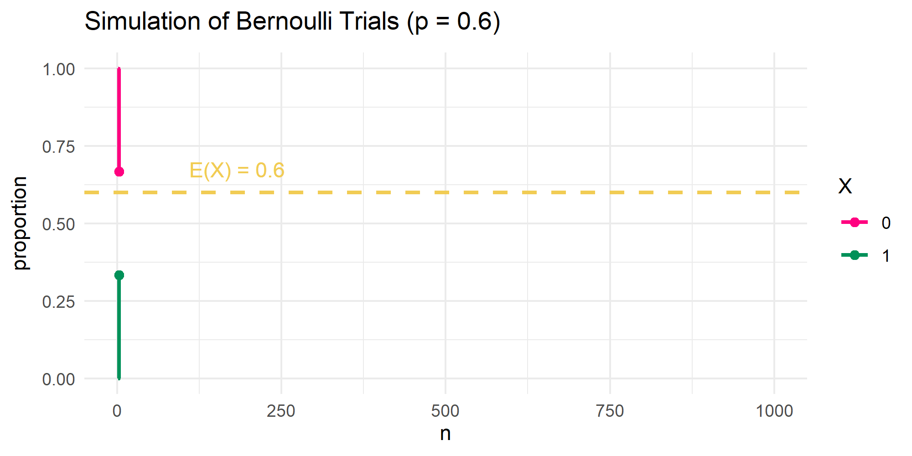

```{r setup, include=FALSE}
knitr::opts_chunk$set(echo = FALSE)
```

```{r echo=FALSE, eval=TRUE,message=FALSE, warning=FALSE}
library(tidyverse)
library(openintro)
library(gridExtra)
data(COL)
seed <- 42
```

## Objectives

:::: {.column width=15%}
::::

:::: {.column width=70%}
- **Develop an understanding of the Law of Large Numbers**
- **Introduce the concept of the long-run average outcome**
- **Know how to simulate random sampling in R**
::::

:::: {.column width=15%}
::::

## Visualizing the Bernoulli PMF

The **Bernoulli PMF** can be visualized using the vertical line plot because the Bernoulli r.v. is discrete.

**Example:** Suppose that $p=0.60$, meaning the the "success" probability is $P(X=1)=0.60$ and the "failure" probability is $P(X=0)=0.40$.

```{r eval=TRUE, echo=FALSE, message=FALSE, warning=FALSE, fig.align='center',fig.width=5,fig.height=3,out.width='60%'}
# set Bernoulli parameter
p <- 0.6

# set PMF of the Bernoulli r.v.
pmf <- tibble(x=c("0","1"),
              p=c(1-p,p))

# plot the Bernoulli distribution and store it into a R variable
p1 <- ggplot(pmf,aes(x=x,y=p)) + 
  geom_point(size=3) + # size here is defined for all points
  geom_segment(aes(x=x,xend=x,
                   y=c(0,0),yend=p)) + # draws a line between two defined points
  ggtitle(paste("Bernoulli PMF (p = ",p,")",sep="")) + # sets the title of the plot
  ylim(0,1) + # set limits of the y-axis for viewing
  scale_x_discrete(labels=c("0"="0","1"="1")) + 
  theme_minimal() # set theme of entire plot

# display plot
p1
```

## Simulating Bernoulli Trials

A **Bernoulli trial** is a random experiment with two possible outcomes: success ($1$) or failure ($0$). The following R code uses the `tidyverse` package.

```{r eval=TRUE, echo=TRUE, message=FALSE, warning=FALSE}
# set hyperparameters
set.seed(42) # for reproducibility
n <- 10 # number of trials

# set parameter and PMF of the Bernoulli r.v
X <- c("1","0") # outcomes ("1"="success","0"="failure")
p <- 0.6 # probability of success
bern_pmf <- c(p,1-p) # an ordered list of outcome probabilities

# simulate n Bernoulli trials
samples <- sample(
  X, # set sample space
  size = n, # set number of samples
  prob = bern_pmf, # set probabilities for each outcome
  replace = TRUE # sampling with replacement
  )

# convert samples into tibble form and compute proportions
samples_tib <- tibble(X = samples) %>% 
  # group by outcome
  group_by(X) %>% 
  # summarisse by counting each outcome
  summarise(
    count = n(), # compute frequencies
    proportion= count/n # compute relative frequencies
    )

# view tibble
samples_tib
```

## Visualizing the Simulated Bernoulli Trials

The Bernoulli trials simulations are considered nominal categorical data. A bar plot that shows the proportion of "success" and "failure" outcomes are most appropriate.

```{r eval=TRUE, echo=FALSE, message=FALSE, warning=FALSE, fig.align='center',fig.width=5,fig.height=3,out.width='60%'}
# create the Bernoulli trials plot and store it into a R variable
p2 <- ggplot(samples_tib,aes(x=X,y=proportion)) + 
  geom_col(fill="#009159") + 
  ylim(0,1) + # set limits of the y-axis for viewing
  ggtitle(paste("Bernoulli Trials ","(n = ",n,", p = ",p,")",sep="")) + 
  theme_minimal() # set theme of entire plot

# display plot
p2
```

## Comparing the Bernoulli PMF vs the Trials

We can compare the Bernoulli PMF and the Trials by plotting the plots side-by-side for easy comparison. 

```{r eval=TRUE, echo=FALSE, message=FALSE, warning=FALSE, fig.align='center',fig.width=7,fig.height=3,out.width='60%'}
# view the Bernoulli PMF and the trials
grid.arrange(p1,p2,ncol=2)
```

::: {style="color: red;"}
$\star$ Since we only have $10$ trials the proportions of the samples is not quite the same as the parameters of the Bernoulli r.v. due to **sampling variability**.
:::

## Increasing the Number of Bernoulli Trials

Suppose we increase the number of Bernoulli Trials and compare it to the Bernoulli PMF.

Let $p = 0.60$ ("success" probability) and $n = 1000$ (number of Bernoulli Trials).

```{r eval=TRUE, echo=FALSE, message=FALSE, warning=FALSE, fig.align='center',fig.width=7,fig.height=3,out.width='60%'}
# set hyperparameters
set.seed(42) # for reproducibility
n <- 1000 # number of trials

# set parameter and PMF of the Bernoulli r.v
X <- c("0","1") # outcomes ("0"="failure","1"="success")
p <- 0.6 # probability of success
bern_pmf <- c(1-p,p)

# simulate n Bernoulli trials
samples <- sample(X,size=n,prob=bern_pmf,replace=TRUE)

# convert samples into tibble form and compute proportions
samples_tib <- tibble(X=samples) %>% 
  group_by(X) %>% 
  summarise(count=n(),proportion=count/n)

# create the Bernoulli trials plot and store it into a R variable
p2 <- ggplot(samples_tib,aes(x=X,y=proportion)) + 
  geom_col(fill="#009159") + 
  ylim(0,1) + # set limits of the y-axis for viewing
  ggtitle(paste("Bernoulli Trials ","(n = ",n,", p = ",p,")",sep="")) + 
  theme_minimal() # set theme of entire plot

# view the Bernoulli PMF and the trials
grid.arrange(p1,p2,ncol=2)
```

::: {style="color: red;"}
$\star$ As we increase the number of Bernoulli trials from $n = 10$ to $n = 1000$, the proportion of $1$ and $0$ are close to the Bernoulli PMF, which shows the **frequentist interpretation of Probability**.
:::

## The Law of Large Numbers

The **Law of Large Numbers** states that as the number of trials in a random experiment increases, the sample mean approaches the expected value.

**Example Bernoulli Trials Simulation** 

Let $p = 0.60$ be the "success" probability of a Bernoulli r.v., $X \sim \text{Bern}(0.60)$, where $\text{E}(X) = 0.60$.

```{r echo=FALSE, eval=TRUE, fig.align='center', out.width='70%', message=FALSE, warning=FALSE}

```

::: {style="color: red;"}
$\star$ By the Law of Large Numbers, as the number of Bernoulli trials increases, the sample proportion of "success" converges to the expected value.
:::
