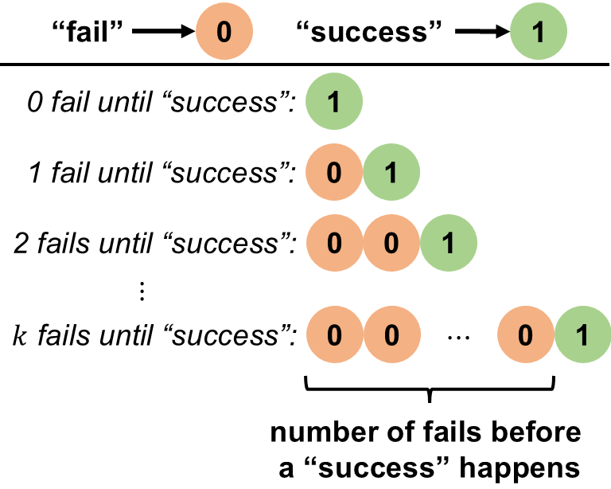
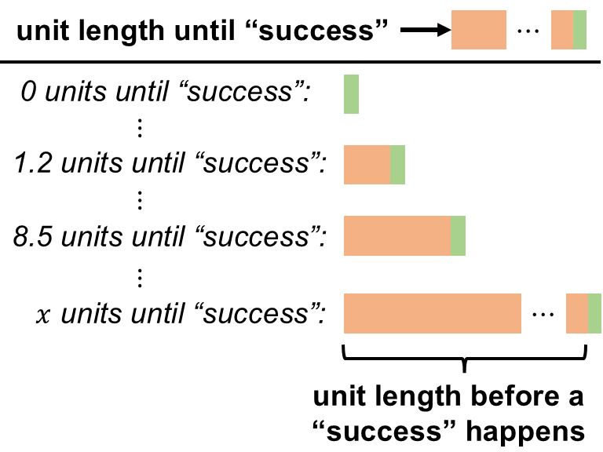
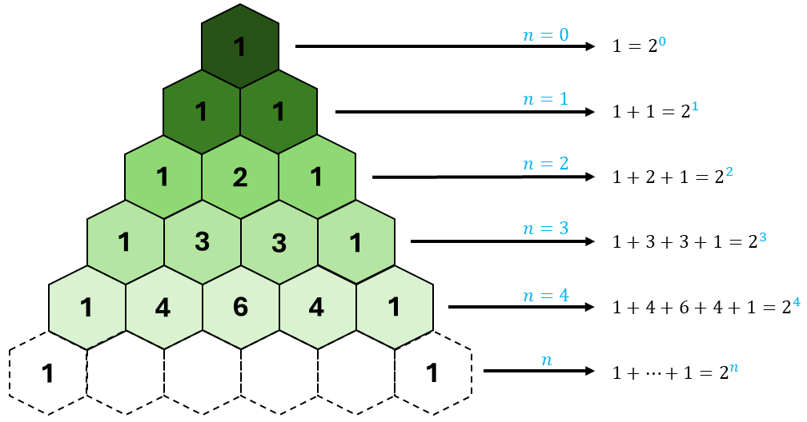
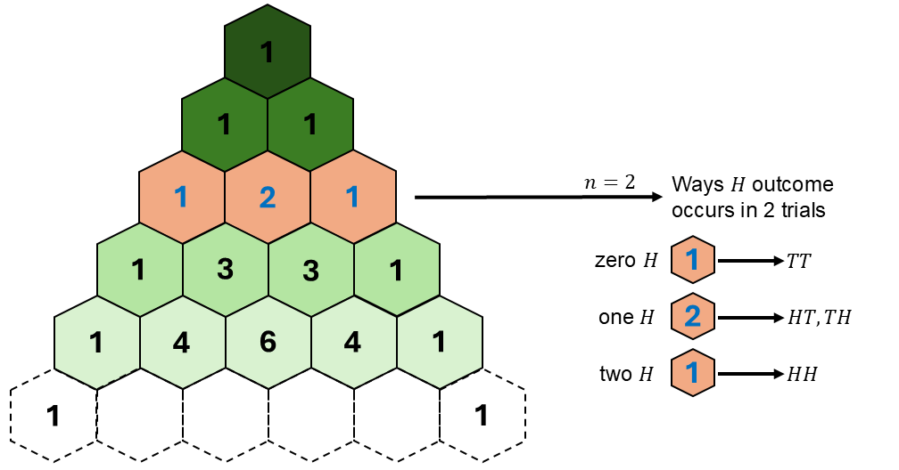
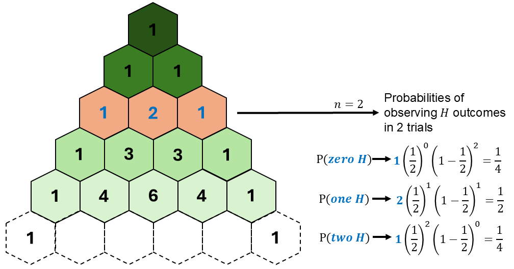
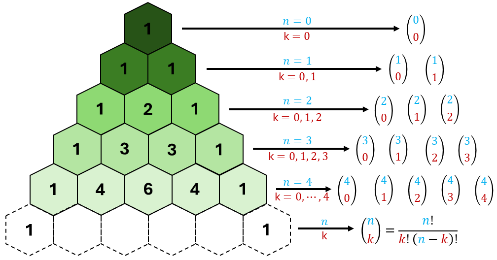

```{r setup, include=FALSE}
knitr::opts_chunk$set(echo = FALSE)
```

```{r echo=FALSE, eval=TRUE,message=FALSE, warning=FALSE}
library(tidyverse)
library(openintro)
library(gghighlight)
data(COL)
seed <- 42
```

## Objectives

:::: {.column width=15%}
::::

:::: {.column width=70%}
- **Develop an understanding of the exponential random variable**
- **Develop an understanding of the normal random variable**
- **Know how to compute probabilities of the exponential and normal random variables**
::::

:::: {.column width=15%}
::::

## Rate to "Success" (Discrete)

:::: {.column width=50%}
```{r echo=FALSE, fig.align='center', out.width = '100%'}

```
:::

:::: {.column width=49%}
**Geometric R.V. (Revisited)**

- Independent Bernoulli trials with "success" probability $p$
- Count the number of "fail" trials before the first "success"
- The probability of getting $k$ number of "fail" before a "success" follows the Geometric PMF
- The expected number of fails before a "success" is $\frac{1-p}{p}$
::::

::: {style="color: red;"}
$\star$ In a time-based interpretation, if events occur in discrete time steps, the geometric r.v. represents the number of time steps required until an event of interest happens.
:::

## Assessment Retakes

A professor allows students to take a short assessment quiz, and if they do not pass, they can revise their answers and retake the quiz in the next session. The probability that a student passes on any given attempt is $p=0.40$, and attempts continue until the student passes.

Let $X$ be the number of "fail" attempts before the student get a "pass".

:::: {.column width=49%}
**Information Given:**

* R.V. is $X \sim \text{Geom}(p)$
* Expected value is $\text{E}(X) = \frac{1-p}{p}$
* What is the expected number of "fail" until a student get a "pass"? $$\text{E}(X) = \frac{1-0.40}{0.40} = 1.5$$

::: {style="color: red;"}
$\star$ On average, the student would "fail" on their 1st attempt before they get a "pass". The chances of a "pass" with $1$ "fail" attempt is $0.64$.
:::
::::

:::: {.column width=49%}
**Computing Probabilities:**

* Geometric PMF is $P(X=k) = (1-p)^k p$
* What is the probability that a student get a "pass" with at most $1$ "fail" attempt? 
$$
\begin{aligned}
P(X \le 1) & = \sum_{k=0}^1 P(X=k) \\
           & = (0.60)^0 (0.40) + (0.60)^1 (0.40) \\
P(X \le 1) & = 0.64
\end{aligned}
$$

**Using R:**

```{r echo=TRUE, eval=TRUE}
pgeom(1,0.40)
```

::::

## Rate to "Success" (Continuous)

:::: {.column width=50%}
```{r echo=FALSE, fig.align='center', out.width = '100%'}

```
:::

:::: {.column width=49%}
**Exponential R.V.**

- Unit length until an event occurs
- "success" event happens at a constant rate
::::

::: {style="color: red;"}
$\star$ In a time-based interpretation, if events occur in continuous time, the exponential r.v. represents the length of time required until an event of interest happens.
:::

## The Exponential R.V.

The **exponential r.v.** is a continuous r.v. that models the time until an event occurs, given that the event happens at a constant rate over time called $\lambda$: $$X \sim \text{Exp}(\lambda)$$

**Sample Space:**

* $x \in [0,\infty)$ because the length of time until an event occurs can be any positive unit length

**Rate Parameter**

* $\lambda$ is reciprocal to the average time of an event occurs.
* This means that --on average-- $\frac{1}{\lambda}$ "success" occurs per unit length.

## The Exponential R.V.: PDF

The exponential r.v. $X \sim \text{Exp}(\lambda)$ has infinite possible outcomes (or infinite sized sample space) where $\lambda > 0$ is the rate of "success" with PDF given as $$f(x) = \lambda e^{-\lambda x}, \quad x \ge 0$$

::: {style="color: red;"}
$\star$ The exponential r.v. models the unit length until an event happens.
:::

## Probabilities of PDFs

A **Probability Density Function (PDF)** $f(x)$ describes the likelihood of a continuous r.v. taking a specific value.

* The probability of a single point is zero for continuous distributions: $$P(X = x) = 0, \ \text{for any } x$$ because continuous distributions are defined over an infinite number of possible values, and the probability at a single point is infinitesimally small.

* Instead, we calculate probabilities over intervals using integration: 

  - Cumulative $\longrightarrow \displaystyle P(X \le x) = \int_{-\infty}^x f(t) \ dt$
  - Interval $\longrightarrow \displaystyle P(a \le X \le b) = \int_a^b f(t) \ dt$

::: {style="color: red;"}
$\star$

* PMF (discrete r.v.): $P(X=k)$ is a meaningful probability
* PDF (continuous r.v.): $P(X=x)=0$, but density matters for interval probabilities.
:::

## Assessment Completion Length

A class of students is taking a quiz, and the time it takes for students to finish the quiz follows an exponential r.v., assuming unlimited quiz time allocation. On average, a student takes 15 minutes to complete the quiz.

Let $X$ represent the time to finish the quiz.

:::: {.column width=49%}
**Information Given:**

* The time it takes for a student to finish a quiz follows an exponential distribution: $$X \sim \text{Exp}(\lambda)$$ where $\lambda$ is the rate parameter.
* $\lambda = \frac{1}{15}$, which can be interpreted in two ways:
    - on average, one student finishes the quiz in 15 minutes
    - on average, a student finishes $\frac{1}{15}$ part of the quiz per minute
::::

:::: {.column width=50%}
**Computing Probabilities:**

* The exponential PDF is $$f(x) = \frac{1}{15} e^{-\frac{1}{15} x}$$
* What is the probability that a student finishes a quiz less than or equal to 15 minutes?
\[
\begin{aligned}
P(X \le 15) & = \int_0^{15} f(x) \ dx \\
            & = \int_0^{15} \frac{1}{15} e^{-\frac{1}{15} x} \ dx \\
P(X \le 15) & \approx 0.632
\end{aligned}
\]

**Using R:**

```{r echo=TRUE, eval=TRUE}
pexp(15,1/15)
```
::::

## Flipping $n$ Coins

Suppose we conduct an experiment of flipping $n$ fair coins. The sample space $S$ contains all possible outcomes, where the number of outcomes is $2^n$.

**Visualizing the possible outcomes using Pascal's triangle**

```{r pascals-triangle-row-sum, echo=FALSE, fig.cap="", out.width="60%", fig.align="center"}

```

::: {style="color: red;"}
$\star$ Pascal's Triangle helps us visualize the total possible sequences of "success" ($H$) outcomes given $n$ independent trials.
:::

## Counting the Number of $H$ outcomes (Discrete)

Let $X$ be the r.v. that counts the number of $H$ outcomes in $n$ trials.

**Pascal's triangle helps us count:**

```{r pascals-triangle-2trial-comb, echo=FALSE, fig.cap="", out.width="60%", fig.align="center"}

```

::: {style="color: red;"}
$\star$ The binomial coefficient tells you how many ways $k$ "success" outcomes can occur in $n$ trials, corresponding to the $k$-th column in the $n$-th row of Pascal’s Triangle.
:::

## Probability of Observing $H$ outcomes in $n$ Trials

Suppose we want to compute the probability of observing a certain number of "success" ($H$) outcomes in $n$ trials. Note that for a fair coin the probability of "success" is $\frac{1}{2}$.

**Pascal's triangle helps us compute these probabilities:**

```{r pascals-triangle-2trial-prob, echo=FALSE, fig.cap="", out.width="60%", fig.align="center"}

```

## Flipping "enough" $n$ Coins (Continuous)

To best illustrate this idea, here is a video.

:::: {.column width=25%}
::::

:::: {.column width=50%}
```{r echo=FALSE, fig.align='center', message=FALSE, warning=FALSE}
library(vembedr)
embed_youtube("UCmPmkHqHXk?si=nLOCdvsdj3oq0wS3")
detach("package:vembedr", unload = TRUE)
```
::::

:::: {.column width=25%}
::::

::: {style="color: red;"}
$\star$ The video explains how random events can produce a predictable pattern, specifically, how many random outcomes together form a normal "bell-curve" distribution.
:::

## Normal Approximation to the Binomial

```{r eval=TRUE, echo=FALSE, message=FALSE, warning=FALSE, fig.align='center',fig.width=7,fig.height=3,out.width='80%'}
# binomial random samples using the binomial pmf
p <- 0.50
n <- 20
N <- 10000
x_binom <- seq(0,n)
binom_samples <- rbinom(N,n,p)

# normal pdf
mu <- n*p
sigma <- sqrt(n*p*(1-p))
x_norm <- seq(0,n,0.10)
norm_pdf <- dnorm(x_norm,mu,sigma)

# convert pmf and pdf into tibble
df_binom <- tibble(x=binom_samples) %>% 
  group_by(x) %>% 
  summarise(x_prop=n()/N)
df_norm <- tibble(x=x_norm, norm_pdf=norm_pdf)

# plot the Bernoulli distribution and store it into a R variable
p1 <- ggplot(df_binom,aes(x=x,y=x_prop)) + 
  geom_col(aes(fill="Binomial Samples")) + 
  geom_line(data=df_norm,aes(x=x,y=norm_pdf, color="Normal PDF"), linewidth=1) + 
  ylab("density") + 
  scale_color_manual(values=c("Normal PDF"="#009159")) +
  scale_fill_manual(values=c("Binomial Samples"="darkgray")) + 
  ggtitle("Binomial Samples Approximated by a Normal Distribution") + # sets the title of the plot
  theme_minimal() + # set theme of entire plot
  theme(legend.title=element_blank())

# display plot
p1
```

::: {style="color: red;"}
$\star$ The Binomial distribution is approximately the normal distribution given large enough samples because of the Law of Large Numbers.
:::

## The Normal R.V.

A **normal r.v.** is a type of continuous r.v. whose probability distribution follows the *normal distribution*, also known as the *Gaussian distribution*. The normal distribution is characterized by two parameters, $\mu$ as the mean and $\sigma^2$ as the variance: $$X \sim \text{N}(\mu,\sigma^2)$$

**Sample Space:**

* $x \in (-\infty,\infty)$ because the normal r.v. can take any value from the entire real number line and it is a continuous random variable.

**Parameters**

* $\mu$ is the mean (center) of the distribution.
* $\sigma^2$ is the variance, which measures the spread of the distribution.

## The Normal R.V.: PDF

The normal r.v. $X \sim \text{N}(\mu,\sigma^2)$ has infinite possible outcomes (or infinite sized sample space) where $\mu$ is the mean and $\sigma^2$ is the variance with PDF given as $$f(x) = \frac{1}{\sqrt{2 \pi \sigma^2}} e^{-\frac{(x-\mu)^2}{2\sigma^2}}, \ -\infty < x < \infty$$

::: {style="color: red;"}
$\star$ The normal r.v. often approximates the distribution of many types of data, especially when there are large numbers of independent factors contributing to the outcome.
:::

## Appendix: The Binomial Coefficient

**Pascal’s Triangle and Combinations** This formula calculates the number of ways to choose $k$ elements from a set of $n$. Each number in Pascal’s Triangle corresponds to a combination. Also known as the **binomial coefficient**.

```{r pascals-triangle-binom-comb, echo=FALSE, fig.cap="", out.width="60%", fig.align="center"}

```
