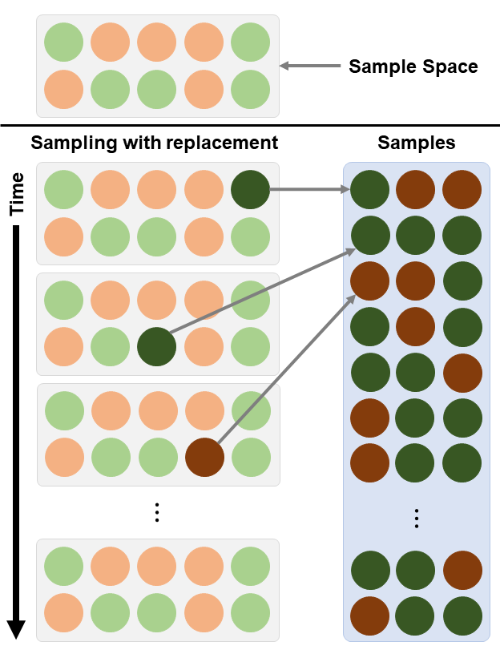
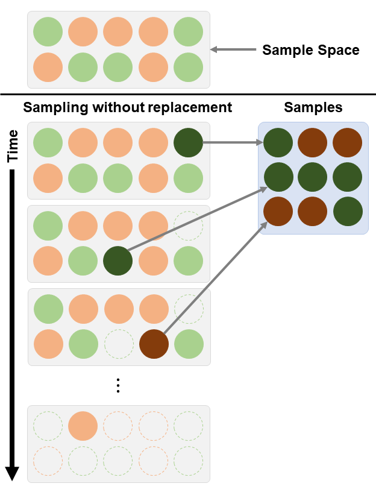
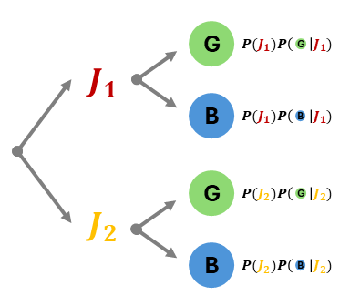
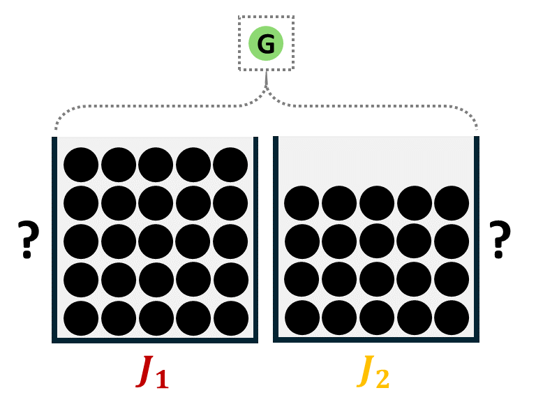
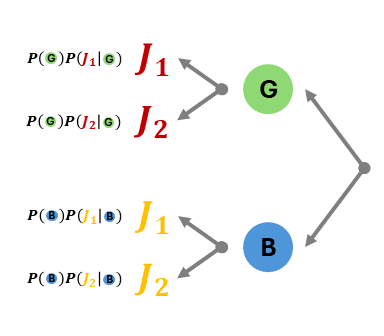
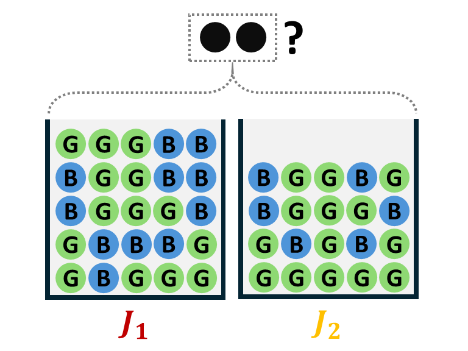
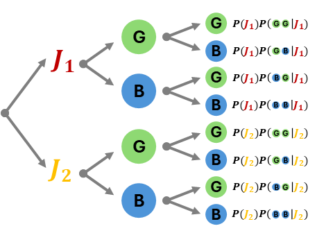
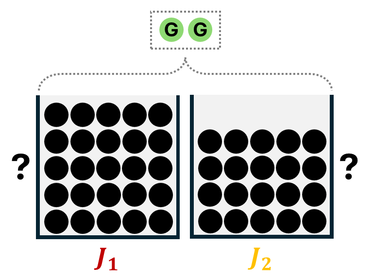
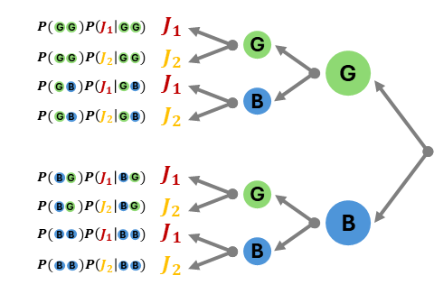

```{r setup, include=FALSE}
knitr::opts_chunk$set(echo = FALSE)
```

```{r echo=FALSE, eval=TRUE,message=FALSE, warning=FALSE}
library(tidyverse)
library(openintro)
library(gghighlight)
library(latex2exp)
data(COL)
seed <- 42
```

## Objectives

:::: {.column width=15%}
::::

:::: {.column width=70%}
- **Introduce conditional probability**
- **Develop an understanding of dependent events**
- **Know how to compute conditional probabilities**
- **Introduce Bayes' theorem and how it relates to classical statistics**
::::

:::: {.column width=15%}
::::

## Why Learn Conditional Probability in Statistics?

:::: {.column width=49%}
**Understanding Associations:**

* Conditional probability shows how one variable changes given another.
* Forms the conceptual foundation of linear regression.

**Basis for Statistical Inference:**

* Helps compute probabilities of outcomes conditional on observed data.
* Supports hypothesis testing, confidence intervals, and predictive modeling.
::::

:::: {.column width=49%}
**Improves Decision-Making:**

* Guides predictions by updating beliefs with observed information.
* Applied in health, biology, and economics to make informed, data-driven decisions.

**Clarifies Intuition About Data**

* Prevents misinterpretation of correlations and dependencies.
* Essential for correctly interpreting regression coefficients and p-values.
::::

## Sampling with Replacement

**Sampling with replacement** is a sampling method where each selected unit is returned to the population before the next selection. Each selection is independent of previous selection.

:::: {.column width=50%}
**Characteristics:**

* The population remains unchanged after each selection.
* Each item can be chosen more than once.
* Items are independently chosen with the same probability.
::::

:::: {.column width=49%}
```{r sampling-with-replacement, echo=FALSE, fig.cap="", out.width="70%", fig.align="center"}

```
::::

## Sampling without Replacement

**Sampling without replacement** is a sampling method where each selected unit is not returned to the population before the next draw. Each selection depends on previous selections, as the population size decreases.

:::: {.column width=50%}
**Characteristics:**

* The population changes after each selection.
* Each item can be chosen only once.
* Items are dependently chosen with changing probability.
::::

:::: {.column width=49%}
```{r sampling-without-replacement, echo=FALSE, fig.cap="", out.width="70%", fig.align="center"}

```
::::

## With vs Without Replacement

| **Feature** | **Sampling with Replacement** | **Sampling without Replacement** |
|:---|:---|:---|
| _Independence_ | Yes | No |
| _Duplication_ | Yes | No |
| _Changing Sample Space_ | No | Yes |
| _Changing Probabilities_ | No | Yes |

## Drawing Cards (with Replacement)

You draw cards from a standard $52$-card deck.

:::: {.column width=49%}
**With Replacement:**

* After drawing a card, you put it back into the deck.
* The deck resets to $52$ cards every time.
* Each draw is independent.

::: {style="color: red;"}
$\star$ Outcomes do not affect future draws.
:::
::::

:::: {.column width=49%}
**Example:**

* Probability of drawing an Ace on each draw: $$P(\text{Ace}) = \frac{4}{52} \text{ or } \frac{1}{13}$$ because there are four Aces in the deck out of 52 cards.
* Same probability at every draw.
::::

## Drawing Cards (without Replacement)

You draw cards from a standard 52-card deck.

:::: {.column width=49%}
**Without Replacement:**

* After drawing a card, you do not put it back.
* The number of cards from the deck decreases each time you draw.
* Each draw is dependent, except for the first draw.

::: {style="color: red;"}
$\star$ Outcomes change future probabilities.
:::
::::

:::: {.column width=49%}
**Example:**

* 1st draw: $P(\text{Ace}_1) = \frac{4}{52}$
* 2nd draw: $P(\text{Ace}_2 \text{ given } \text{Ace}_1) = \frac{3}{51}$

**Multiplication Rule:** 

* *What is the probability that the 1st draw is an Ace and the 2nd draw is another Ace?*

$$
\begin{aligned}
P(\text{Ace}_1 \text{ and Ace}_2) & = P(\text{Ace}_1) P(\text{Ace}_2 \text{ given } \text{Ace}_1) \\
   & = \left( \frac{4}{52} \right) \left( \frac{3}{51} \right) \\
 & = \frac{1}{221} \\
P(\text{Ace}_1 \text{ and Ace}_2) & \approx 0.0045
\end{aligned}
$$
::::

## Conditional Probability

:::: {.column width=49%}
**Why Conditional Probability?**

* Sometimes probabilities change when we have new or extra information.
* That's true in life where change is always happening.

**What is Conditional Probability?**

* The probability of an event $A$, given that event $B$ has already occurred: $$P(A | B)$$ which read as "Probability of $A$ given $B$".
::::

:::: {.column width=49%}
**Definition:**

* Given events $A$ and $B$ in the sample space $S$, $$P(A | B) = \frac{P(A \cap B)}{P(B)}$$ where:

  - $P(A \cap B)$ is the probability that both $A$ and $B$ occur and 
  - $P(B) > 0$ is the probability that $B$ occurs (event $B$ must be possible).
  
::: {style="color: red;"}
$\star$ Conditional probability helps us update probabilities based on new information.
:::
::::

## Multiplication Rule

:::: {.column width=49%}
**Independence:** Given events $A$ and $B$ with non-zero probability in the sample space $S$, the following are equivalent:

* $A$ and $B$ are independent
* $P(A \cap B) = P(A)P(B)$
* $P(A|B) = P(A)$
* $P(B|A) = P(B)$
::::

:::: {.column width=49%}
**Dependence:** Given events $A$ and $B$, then by definition:

* $P(A \cap B) = P(B)P(A|B)$ if $A$ is dependent on $B$ or
* $P(B \cap A) = P(A)P(B|A)$ if $B$ is dependent on $A$.

**Not Always Symmetric:**

$$P(A|B) \ne P(B|A)$$
::::

## One Ball from Jars

:::: {.column width=49%}
**Set-up:**

* Suppose there are two jars $J_1$ and $J_2$ continaing colored balls.
* Assumptions: 
  
  - Each jar is equally likely to get chosen.
  - Balls are identical for each color.
  - Each ball is equally likely to get drawn.

* Jar contents as frequencies:

|   | $J_1$ | $J_2$ |
|:---:|:---:|:---:|
| $G$ | $14$  | $14$ |
| $B$ | $11$  | $6$  |
| Sum | $25$ | $20$ |
::::

:::: {.column width=49%}
**Based on the given information:**

* Jar probabilities:

  - $\displaystyle P(J_1) = \frac{1}{2}$
  - $\displaystyle P(J_2) = \frac{2}{2}$

* Jar contents probabilities:

|   | $J_1$ | $J_2$ |
|:---:|:---:|:---:|
| $G$ | $P(G|J_1) = \frac{14}{25}$  | $P(G|J_2) = \frac{14}{20}$ |
| $B$ | $P(B|J_1) = \frac{11}{25}$  | $P(B|J_2) = \frac{6}{20}$  |

* Jar contents as column proportions (relative frequencies):

|   | $J_1$ | $J_2$ |
|:---:|:---:|:---:|
| $G$ | $0.56$  | $0.70$ |
| $B$ | $0.44$  | $0.30$  |
::::

## One Ball from Jars Sample Space

:::: {.column width=49%}
**Scenario:**

* Randomly choose a Jar.
* Then, randomly draw *one* ball.
* The goal is to determine the probability of a desired outcome of the drawn ball.

```{r echo=FALSE, eval=TRUE, fig.align='center', out.width='100%', message=FALSE, warning=FALSE}

```
::::

:::: {.column width=49%}
**Probability tree:**

```{r echo=FALSE, eval=TRUE, fig.align='center', out.width='100%', message=FALSE, warning=FALSE}

```

::: {style="color: red;"}
$\star$ A probability tree is a way to visualize all possible outcomes in the sample space. We look at all the branches of this tree that corresponds to our desired outcome.
:::
::::

## One Ball from Jars Example

*What is the probability that the ball drawn is $G$?*

$$
\begin{aligned}
P(G) & = P(J_1 \cap G) + P(J_2 \cap G) \\
  & = P(J_1) P(G|J_1) + P(J_2) P(G|J_2) \\
  & = \left(\frac{1}{2}\right) \left(\frac{14}{25}\right) + \left(\frac{1}{2}\right) \left(\frac{14}{20}\right) \\
  & = \frac{63}{100} \\
P(G) & = 0.63 \longleftarrow \text{equivalent to } P(G) = 1 - P(B)
\end{aligned}
$$

## One Ball from Jars in Reverse

With the same set-up and assumptions, we now view the same scenario in reverse.

:::: {.column width=49%}
**Scenario:**

* Randomly choose a Jar.
* Then, randomly draw *one* ball.
* Given the drawn ball, the goal is to determine the probability on what jar it came from.

```{r echo=FALSE, eval=TRUE, fig.align='center', out.width='100%', message=FALSE, warning=FALSE}

```
::::

:::: {.column width=49%}
**Probability tree in reverse:**

```{r echo=FALSE, eval=TRUE, fig.align='center', out.width='100%', message=FALSE, warning=FALSE}

```

::: {style="color: red;"}
$\star$ The reverse probability tree is way to visualize all possible outcomes given a sample (i.e. an observation or a data point).
:::
::::

## One Ball from Jars in Reverse Example

* *Given that the ball drawn is $G$, what is the probability that the ball came from $J_1$?*

$$
\begin{aligned}
P(J_1|G) & = \frac{P(J_1 \cap G)}{P(G)} \\
  & = \frac{P(G|J_1)P(J_1)}{P(G)} \longleftarrow \text{bayes' Rule} \\
  & = \frac{P(G|J_1)P(J_1)}{P(J_1) P(G|J_1) + P(J_2) P(G|J_2)} \\
  & = \frac{\left(\frac{1}{2}\right) \left(\frac{14}{25}\right)}{\left(\frac{1}{2}\right) \left(\frac{14}{25}\right) + \left(\frac{1}{2}\right) \left(\frac{14}{20}\right)} \\
P(J_1|G)  & = \frac{4}{9} \approx 0.444
\end{aligned}
$$

::: {style="color: red;"}
$\star$ This is consistent with the idea that conditional probability is not always symmetric, meaning $P(G|J_1) \ne P(J_1|G)$, because $\displaystyle P(G|J_1) = \frac{14}{25} = 0.56$ is not equal to $\displaystyle P(J_1|G) \approx 0.444$.
:::

## Law of Total Probability

Let $A$ and $B$ be events in the sample space $S$. Then,

$$
\begin{aligned}
P(B) & = P(B \cap A) + P(B \cap A^c) \\
\text{or} & \\
P(B) & = P(B|A)P(A) + P(B|A^c)P(A^c)
\end{aligned}
$$

::: {style="color: red;"}
$\star$ This law decomposes the probability of $A$ given $B$ into two pieces, one where $B$ happens and one where $B$ does not happen.
:::

## Bayes' Rule

Let $A$ and $B$ be events in the sample space $S$.

$$
\begin{aligned}
P(A|B) & = \frac{P(B|A)P(A)}{P(B)} \\
\text{or} & \\
P(A|B) & = \frac{P(B|A)P(A)}{P(B|A)P(A) + P(B|A^c)P(A^c)}
\end{aligned}
$$

::: {style="color: red;"}
$\star$ This rule is a simple statement about conditional probabilities that allows the computation of $P(A|B)$ from $P(A)$. Due to this rule, events $A$ and $B$ are not always symmetric (i.e., $P(A|B) \ne P(B|A)$).
:::

## Two Balls from Jars

With the same set-up and assumptions, we now draw two balls instead of one.

:::: {.column width=49%}
**Scenario:**

* Randomly choose a Jar.
* Then, randomly draw *two* balls.
* The goal is to determine the probability of a desired outcome of the drawn balls.

```{r echo=FALSE, eval=TRUE, fig.align='center', out.width='100%', message=FALSE, warning=FALSE}

```
::::

:::: {.column width=49%}
**Probability tree:**

```{r echo=FALSE, eval=TRUE, fig.align='center', out.width='100%', message=FALSE, warning=FALSE}

```

::: {style="color: red;"}
$\star$ The probability tree now have three levels instead of two because we drew two balls instead of one. Computing the probabilities now depends on whether we sampled with or without replacement.
:::
::::

## Two Balls from Jars (Sampling With Replacement)

**Conditional Probabilities:**

| Combination | $J_1$ | $J_2$ |
|---:|:------|:------|
| $GG$ | $P(GG|J_1) = \left(\frac{14}{25}\right) \left(\frac{14}{25}\right)$ | $P(GG|J_2) = \left(\frac{14}{20}\right) \left(\frac{14}{20}\right)$ |
| $GB$ | $P(GB|J_1) = \left(\frac{14}{25}\right) \left(\frac{11}{25}\right)$ | $P(GB|J_2) = \left(\frac{14}{20}\right) \left(\frac{6}{20}\right)$ |
| $BG$ | $P(BG|J_1) = \left(\frac{11}{25}\right) \left(\frac{14}{25}\right)$ | $P(BG|J_2) = \left(\frac{6}{20}\right) \left(\frac{14}{20}\right)$ |
| $BB$ | $P(BB|J_1) = \left(\frac{11}{25}\right) \left(\frac{11}{25}\right)$ | $P(BB|J_2) = \left(\frac{6}{20}\right) \left(\frac{6}{20}\right)$ |

::: {style="color: red;"}
$\star$ The notation $GG$ represents an event where the 1st draw is a $G$ and the 2nd draw is $G$. The notations $GB$, $BG$, and $GG$ follows the same notation representation of events.
:::

## Example Under Sampling With Replacement

*What is the probability that the two balls drawn contain exactly two $G$?*

$$
\begin{aligned}
P(GG) & = P(J_1)P(GG|J_1) + P(J_2)P(GG|J_2) \\
      & = \left(\frac{1}{2}\right) \left(\frac{14}{25}\right)^2 + \left(\frac{1}{2}\right) \left(\frac{14}{20}\right)^2 \\
P(GG) & = \frac{2009}{5000} \approx 0.402
\end{aligned}
$$

## Two Balls from Jars (Sampling Without Replacement)

**Conditional Probabilities:**

| Combination | $J_1$ | $J_2$ |
|---:|:------|:------|
| $GG$ | $P(GG|J_1) = \left(\frac{14}{25}\right) \left(\frac{13}{24}\right)$ | $P(GG|J_2) = \left(\frac{14}{20}\right) \left(\frac{13}{19}\right)$ |
| $GB$ | $P(GB|J_1) = \left(\frac{14}{25}\right) \left(\frac{11}{24}\right)$ | $P(GB|J_2) = \left(\frac{14}{20}\right) \left(\frac{6}{19}\right)$ |
| $BG$ | $P(BG|J_1) = \left(\frac{11}{25}\right) \left(\frac{14}{24}\right)$ | $P(BG|J_2) = \left(\frac{6}{20}\right) \left(\frac{14}{19}\right)$ |
| $BB$ | $P(BB|J_1) = \left(\frac{11}{25}\right) \left(\frac{10}{24}\right)$ | $P(BB|J_2) = \left(\frac{6}{20}\right) \left(\frac{5}{19}\right)$ |

::: {style="color: red;"}
$\star$ The multiplication rule of dependent events was used on determining these probabilities. Notice that the successive factors for each probability has changed.
:::

## Example Under Sampling Without Replacement

*What is the probability that the two balls drawn contain exactly two $G$?*

$$
\begin{aligned}
P(GG) & = P(J_1)P(GG|J_1) + P(J_2)P(GG|J_2) \\
  & = \left(\frac{1}{2}\right) \left(\frac{14}{25}\right) \left(\frac{13}{24}\right) + \left(\frac{1}{2}\right) \left(\frac{14}{20}\right) \left(\frac{13}{19}\right) \\
P(GG) & = \frac{4459}{11400} \approx 0.391 \\
\end{aligned}
$$

## Two Balls from Jars in Reverse

With the same set-up and assumptions, we now view the same scenario in reverse.

:::: {.column width=49%}
**Scenario:**

* Randomly choose a Jar.
* Then, randomly draw *two* balls.
* Given the drawn balls, the goal is to determine the probability on what jar they came from.

```{r echo=FALSE, eval=TRUE, fig.align='center', out.width='100%', message=FALSE, warning=FALSE}

```
::::

:::: {.column width=49%}
**Probability tree in reverse:**

```{r echo=FALSE, eval=TRUE, fig.align='center', out.width='100%', message=FALSE, warning=FALSE}

```

::: {style="color: red;"}
$\star$ You still need to consider whether the balls are sampled with or without replacement and Bayes' Rule has to be applied to compute the probabilities.
:::
::::

## Two Balls from Jars in Reverse Example

Assume that we sample without replacement.

* *Given that exactly two $G$ balls are drawn, what is the probability that the balls came from $J_1$?*

$$
\begin{aligned}
P(J_1|GG) & = \frac{P(J_1 \cap GG)}{P(GG)} \\
  & = \frac{P(GG|J_1)P(J_1)}{P(GG)} \longleftarrow \text{bayes' Rule} \\
  & = \frac{P(GG|J_1)P(J_1)}{P(J_1) P(GG|J_1) + P(J_2) P(GG|J_2)} \\
  & = \frac{\left(\frac{1}{2}\right) \left(\frac{14}{25}\right) \left(\frac{13}{24}\right)}{\left(\frac{1}{2}\right) \left(\frac{14}{25}\right) \left(\frac{13}{24}\right) + \left(\frac{1}{2}\right) \left(\frac{14}{20}\right) \left(\frac{13}{19}\right)} \\
P(J_1|GG) & = \frac{19}{49} \approx 0.388
\end{aligned}
$$

::: {style="color: red;"}
$\star$ The complement probability $P(J_2|GG) = 1- P(J_1|GG) = 1 - 0.388 = 0.612$ indicates that the balls are more likely to have come from $J_2$.
:::

## Disease Testing

:::: {.column width=49%}
**Scenario:** 

A person takes a test for a rare disease. *How do we know the probability they actually have the disease given a positive test result?*

* Let $D$ be the event that the person actually have the disease.
* Let $+$ be the event that the person tested positive of the disease.

**Information given:**

* Disease prevalence: $P(D) = 0.01$
* True positive rate of the test: $P(+|D) = 0.99$
* False positive rate of the test: $P(+|D^c) = 0.05$
::::

:::: {.column width=49%}
**Bayes' Rule:**

$$
\begin{aligned}
P(D|+) & = \frac{P(+|D)P(D)}{P(+)} \\
  & = \frac{P(+|D)P(D)}{P(+|D)P(D) + P(+|D^c)P(D^c)} \\
  & = \frac{(0.99)(0.01)}{(0.99)(0.01) + (0.05)(1-0.01)} \\
  & = \frac{0.0099}{0.0594} \\
P(D|+) & \approx 0.167
\end{aligned}
$$

**Interpretation:**

* Even with a highly accurate test, the probability of actually having the disease given a positive result can be low if the disease is rare.

::: {style="color: red;"}
$\star$ This highlights the importance of considering prior probabilities (prevalence).
:::
::::

## A Fundamental Concept in Statistical Thinking

Bayes' Theorem (or Bayes' Rule), which provides a formula for updating the probability of a hypothesis based on new evidence, is often described through various colloquialisms in statistics.

:::: {.column width=49%}
**Hypothesis statements and data:**

Consider hypothesis statements as events and data as an observed evidence.

* Let $H$ be a hypothesis.
* Let $E$ be a an observed evidence.

According to Bayes' Rule,

$$
\begin{aligned}
P(H|E) & = \frac{P(E|H)P(H)}{P(E)} \\
\text{or} & \\
\text{posterior} & = \frac{\text{likelihood} \times \text{prior}}{\text{marginal}}.
\end{aligned}
$$

::: {style="color: red;"}
$\star$ In short, learning from data means continuously revising what you think is true as new evidence comes.
:::
::::

:::: {.column width=49%}
**Terms explained:**

* *Posterior:* The probability of your hypothesis given the observed evidence. Your updated degree of belief.
* *likelihood:* The probability of the observed evidence given the hypothesis is true. This describes how well the evidence fits the hypothesis. 
* *Prior:* The probability of your hypothesis *before* observing the evidence. Your initial hunch or the baseline probability.
* *Marginal:* The probability of the observed evidence under all possible hypotheses describes how common or rare the observation actually is.
::::

## Frequentist vs Bayesian Probabilities (1/2)

:::: {.column width=49%}
**Frequentist Perspective:**

* Probability is interpreted as the long-run relative frequency of events.
* Population parameters are fixed but unknown.
* Data is random and it comes from repeated sampling.

::: {style="color: blue;"}
$\dagger$ This course only focuses on the statistical methods based on the frequentist perspective of probability.
:::
::::

:::: {.column width=49%}
**In inference:**

  - It assumes the null hypothesis $H_0$ to be true.
  - Then, it computes the *p-value*, which is interpreted as the probability of observing data as extreme as what we saw, given $H_0$ is true.
  - The decision is either reject or fail to reject $H_0$ according to some subjective threshold.
  
::: {style="color: red;"}
$\star$ Most statistical methods introduced in high school and early college are primarily based on the frequentist perspective of probability.
:::
::::

## Frequentist vs Bayesian Probabilities (2/2)

:::: {.column width=49%}
**Bayesian Perspective:**

* Probability is interpreted as the degree of belief updated with evidence.
* Population parameters are random variables.
* It combines initial belief, observed evidence, and updated belief.

::: {style="color: blue;"}
$\dagger$ There is actually different forms of Bayes' Theorem but let's just table that until our next life.
:::
::::

:::: {.column width=49%}
**In inference:**

  - It assumes a prior belief or an initial belief about a hypothesis.
  - Then, it calculates the likelihood on how well the observation supports that initial hypothesis and determining how common or rare is the observation overall.
  - It makes decisions based on the updated belief after having the observed evidence.

::: {style="color: red;"}
$\star$ By combining frequentist and Bayesian approaches, you can perform more flexible and powerful statistical analyses.
:::
::::
