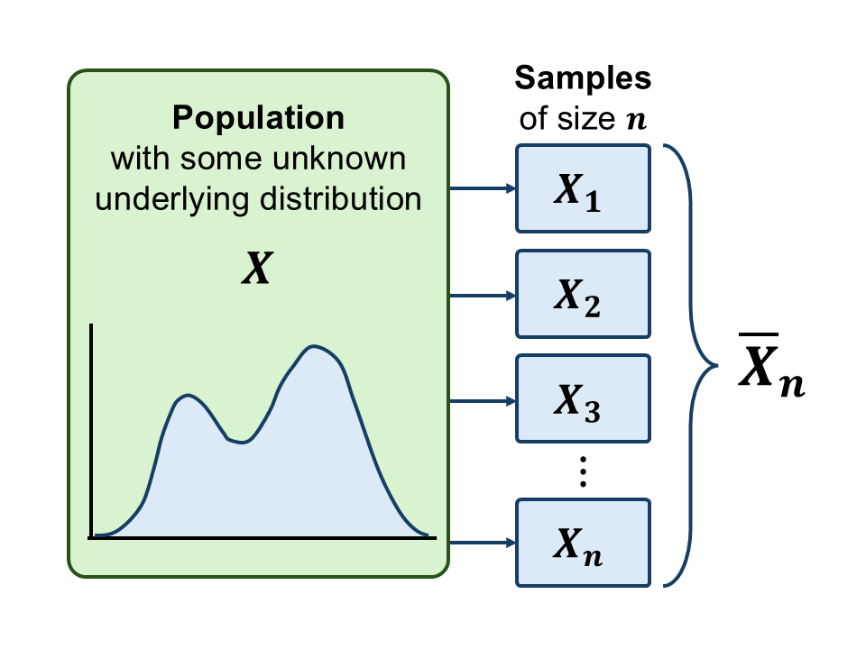

```{r setup, include=FALSE}
knitr::opts_chunk$set(echo = FALSE)
```

```{r echo=FALSE, eval=TRUE,message=FALSE, warning=FALSE}
library(tidyverse)
library(openintro)
library(gridExtra)
library(latex2exp)
data(COL)
seed <- 42
```

## Objectives

:::: {.column width=15%}
::::

:::: {.column width=70%}
- **Introduce the Central Limit Theorem (CLT)**
- **Develop an understanding how CLT works**
- **Know how to use the standard normal distribution**
::::

:::: {.column width=15%}
::::

## The Central Limit Theorem (CLT)

:::: {.column width=49%}
```{r data-science-life-cycle, echo=FALSE, fig.align='center', out.width = '100%'}

```
::::

:::: {.column width=49%}
**Definition:**

* Let $X_1,X_2, \cdots X_n$ be i.i.d. r.v.s, which denote a statistical sample of size $n$ from a population distribution with finite positive variance.
* Let $\overline{X}_n$ a statistical measurement (i.e. sample mean), which is itself a r.v..
* The limit as $n \to \infty$ of the distribution of $\overline{X}_n$ is a normal distribution.

::: {style="color: red;"}
$\star$ The distribution of $\overline{X}_n$ is called the sampling distribution.
:::
::::

## The Sampling Distribution

:::: {.column width=49%}
**Definition:**

* A probability distribution of a statistic.
* A statistic can be: proportion, mean, median, standard deviation, etcetera.

**CLT Conditions:**

* **Independence:** Sample values must be independent
* **Identical Distribution:** Variables should be from the same distribution
* **Finite Variance:** The population must have a finite variance
* **Large Sample Size:** A larger sample size improves approximation
::::

:::: {.column width=49%}
**The Normal Distribution:**

The normal distribution is a type of a sampling distribution as long the CLT conditions hold.

```{r eval=TRUE, echo=FALSE, message=FALSE, warning=FALSE, fig.align='center',fig.width=7,fig.height=3,out.width='100%'}
# normal pdf
mu <- 0
sigma <- 1
x_norm <- seq(-4,4,0.10)
norm_pdf <- dnorm(x_norm,mu,sigma)

# convert pdf into tibble
df_norm <- tibble(x=x_norm, norm_pdf=norm_pdf)

# plot the Bernoulli distribution and store it into a R variable
p1 <- ggplot(df_norm,aes(x=x,y=norm_pdf)) + 
  geom_line(color="#009159",linewidth=1) + 
  geom_ribbon(data=subset(df_norm,x>=-4 & x<=4),aes(x=x,ymax=dnorm(x,mu,sigma)),ymin=0,alpha=0.3,fill="#009159") +
  xlab("") + 
  ylab("") +
  theme_minimal() + # set theme of entire plot
  theme(panel.grid = element_blank(),
        legend.title=element_blank(),
        axis.ticks.x = element_blank(),
        axis.text.x = element_blank(),
        axis.ticks.y = element_blank(),
        axis.text.y = element_blank())

# display plot
p1
```

::: {style="color: red;"}
$\star$ With a sufficiently large sample size, the mean of the sampling distribution is approximately equal to the corresponding parameter of the underlying population.
:::
::::

## Mean Annual Income

:::: {.column width=49%}
Suppose we want to estimate the mean annual income of a city.

**Set-up:**

* The income distribution is highly skewed (not normal).
* We take a random sample of $n=100$ people and compute the sample mean $\overline{x} = 70$ (in thousands).

**CLT:**

* We assume that $\overline{x}$ came from $\overline{X}$.
* The distribution of $\overline{X}$ is approximately normal.
* Let $\mu$ be the true population mean with variance $\sigma^2$.
* The population parameters $\mu$ and $\sigma$ may or may not be known.
::::

:::: {.column width=49%}
**Why it matters for parameter estimation:**

* Construct confidence intervals for $\mu$.
* We can use the confidence interval to estimate the true mean income.

**Why it matters for hypothesis testing:**

* Suppose that our null hypothesis is $\mu > 50$.
* Using CLT, we can compute the probability of observing a sample mean as extreme as $\overline{x} = 70$, assuming the null hypothesis is true.
* This probability is called the *p-value*.

::: {style="color: red;"}
$\star$ The p-value answers the question: If the true mean were $50$, how likely is it to observe a sample mean this far (or farther) from $50$ just by random chance?
:::
::::

## Interval Probabilities (1/4)

:::: {.column width=50%}
**Normal Distribution**

```{r eval=TRUE, echo=FALSE, message=FALSE, warning=FALSE, fig.align='center',fig.width=5,fig.height=3,out.width='100%'}
# set parameters, outcomes, and probabilities
mu <- 20*0.50
sd <- sqrt(20*0.50*(1-0.50))
x_outcomes <- seq(0,20,0.10) # set outcome from 0 to 20 (technically infinite)
norm_pdf <- dnorm(x_outcomes,mu,sd) # function `dnorm()` is the Normal PDF 
df <- tibble(x=x_outcomes, pdf=norm_pdf) # convert to tibble

# plot the Bernoulli distribution and store it into a R variable
p1 <- ggplot(df,aes(x=x,y=pdf)) + 
  geom_line(size=1,color="black") + # size here is defined for all points
  geom_ribbon(data=subset(df,x>=7 & x<=14),aes(x=x,ymax=dnorm(x,mu,sd)),ymin=0,alpha=0.3,fill="blue") +
  ggtitle(TeX(paste("Normal Distribution ","$\\mu$","=",mu," ","$s$","=",round(sd,2)))) + # sets the title of the plot
  theme_minimal() # set theme of entire plot

# display plot
p1
```
::::

:::: {.column width=49%}
**Example:**

What is $P(7 \le X \le 14)$ for $X \sim \text{N}(10,2.24)$? 
\[
\begin{aligned}
P(7 \le X \le 13) & = P(X \le 13) - P(X \le 7) \\
P(7 \le X \le 13) & \approx 0.8727
\end{aligned}
\]

**Using R:**

```{r echo=TRUE, eval=TRUE}
pnorm(14,10,2.24)-pnorm(7,10,2.24)
```
::::

::: {style="color: red;"}
$\star$ Note that the Normal PDF is symmetrical but the interval probability we just computed was not.
:::

## Interval Probabilities (2/4)

:::: {.column width=50%}
**Normal Distribution**

```{r eval=TRUE, echo=FALSE, message=FALSE, warning=FALSE, fig.align='center',fig.width=5,fig.height=3,out.width='100%'}
# set parameters, outcomes, and probabilities
mu <- 20*0.50
sd <- sqrt(20*0.50*(1-0.50))
x_outcomes <- seq(0,20,0.10) # set outcome from 0 to 20 (technically infinite)
norm_pdf <- dnorm(x_outcomes,mu,sd) # function `dnorm()` is the Normal PDF 
df <- tibble(x=x_outcomes, pdf=norm_pdf) # convert to tibble

# plot the Bernoulli distribution and store it into a R variable
p1 <- ggplot(df,aes(x=x,y=pdf)) + 
  geom_line(size=1,color="black") + # size here is defined for all points
  geom_ribbon(data=subset(df,x>=mu-sd & x<=mu+sd),aes(x=x,ymax=dnorm(x,mu,sd)),ymin=0,alpha=0.3,fill="blue") +
  ggtitle(TeX(paste("Normal Distribution ","$\\mu$","=",mu," ","$s$","=",round(sd,2)))) + # sets the title of the plot
  theme_minimal() # set theme of entire plot

# display plot
p1
```
::::

:::: {.column width=49%}
**Example:**

What is $P(7.7639 \le X \le 12.2361)$ for $X \sim \text{N}(10,2.24)$? 
\[
\begin{aligned}
P(7.7639 \le X \le 12.2361) & = P(X \le 12.2361) - P(X \le 7.7639) \\
P(7.7639 \le X \le 12.2361) & \approx 0.6818
\end{aligned}
\]

**Using R:**

```{r echo=TRUE, eval=TRUE}
pnorm(12.2361,10,2.24)-pnorm(7.7639,10,2.24)
```
::::

::: {style="color: red;"}
$\star$ Note that $P(7.7639 \le X \le 12.2361) = P(10-2.24 \le X \le 10+2.24) \approx 0.6818$.
:::

## Interval Probabilities (3/4)

:::: {.column width=50%}
**Normal Distribution**

```{r eval=TRUE, echo=FALSE, message=FALSE, warning=FALSE, fig.align='center',fig.width=5,fig.height=3,out.width='100%'}
# set parameters, outcomes, and probabilities
mu <- 300*0.50
sd <- sqrt(300*0.50*(1-0.50))
x_outcomes <- seq(100,200,0.10) # set outcome from 0 to 20 (technically infinite)
norm_pdf <- dnorm(x_outcomes,mu,sd) # function `dnorm()` is the Normal PDF 
df <- tibble(x=x_outcomes, pdf=norm_pdf) # convert to tibble

# plot the Bernoulli distribution and store it into a R variable
p1 <- ggplot(df,aes(x=x,y=pdf)) + 
  geom_line(size=1,color="black") + # size here is defined for all points
  geom_ribbon(data=subset(df,x>=mu-sd & x<=mu+sd),aes(x=x,ymax=dnorm(x,mu,sd)),ymin=0,alpha=0.3,fill="blue") +
  ggtitle(TeX(paste("Normal Distribution ","$\\mu$","=",mu," ","$s$","=",round(sd,2)))) + # sets the title of the plot
  theme_minimal() # set theme of entire plot

# display plot
p1
```
::::

:::: {.column width=49%}
**Example:**

What is $P(141.3397 \le X \le 158.6603)$ for $X \sim \text{N}(150,8.66)$? 
\[
\begin{aligned}
P(141.3397 \le X \le 158.6603) & = P(X \le 158.6603) - P(X \le 141.3397) \\
P(141.3397 \le X \le 158.6603) & \approx 0.6827
\end{aligned}
\]

**Using R:**

```{r echo=TRUE, eval=TRUE}
pnorm(158.6603,150,8.66)-pnorm(141.3397,150,8.66)
```
::::

::: {style="color: red;"}
$\star$ Note that $P(141.3397 \le X \le 158.6603) = P(150-8.66 \le X \le 150+8.66) \approx 0.6827$.
:::

## Interval Probabilities (4/4)

:::: {.column width=50%}
**Normal Distribution**

```{r eval=TRUE, echo=FALSE, message=FALSE, warning=FALSE, fig.align='center',fig.width=5,fig.height=3,out.width='100%'}
# set parameters, outcomes, and probabilities
mu <- 20*0.50
sd <- sqrt(20*0.50*(1-0.50))
x_outcomes <- seq(0,20,0.10) # set outcome from 0 to 20 (technically infinite)
norm_pdf <- dnorm(x_outcomes,mu,sd) # function `dnorm()` is the Normal PDF 
df <- tibble(x=x_outcomes, pdf=norm_pdf) # convert to tibble

# plot the Bernoulli distribution and store it into a R variable
p1 <- ggplot(df,aes(x=x,y=pdf)) + 
  geom_line(size=1,color="black") + # size here is defined for all points
  geom_ribbon(data=subset(df,x>=mu-2*sd & x<=mu+2*sd),aes(x=x,ymax=dnorm(x,mu,sd)),ymin=0,alpha=0.3,fill="blue") +
  ggtitle(TeX(paste("Normal Distribution ","$\\mu$","=",mu," ","$s$","=",round(sd,2)))) + # sets the title of the plot
  theme_minimal() # set theme of entire plot

# display plot
p1
```
::::

:::: {.column width=49%}
**Example:**

What is $P(5.5279 \le X \le 14.4721)$ for $X \sim \text{N}(10,2.24)$? 
\[
\begin{aligned}
P(5.5279 \le X \le 14.4721) & = P(X \le 14.4721) - P(X \le 5.5279) \\
P(5.5279 \le X \le 14.4721) & \approx 0.9541
\end{aligned}
\]

**Using R:**

```{r echo=TRUE, eval=TRUE}
pnorm(14.4721,10,2.24)-pnorm(5.5279,10,2.24)
```
::::

::: {style="color: red;"}
$\star$ Note that $P(5.5279 \le X \le 14.4721) = P(10-2 \times 2.24 \le X \le 10+2 \times 2.24) \approx 0.9541$.
:::

::: {style="color: blue;"}
$\dagger$ Is $P(141.3397 \le X \le 158.6603) = P(150-2 \times 8.66 \le X \le 150+2 \times 8.66) \approx 0.95$?
:::

## The 68-95-99.7 Rule (1/3)

**1st standard deviation from the mean**

$$P(\mu - \sigma \le X \le \mu + \sigma) \approx 0.68$$

```{r eval=TRUE, echo=FALSE, message=FALSE, warning=FALSE, fig.align='center',fig.width=7,fig.height=3,out.width='80%'}
# normal pdf
mu <- 0
sigma <- 1
x_norm <- seq(-4,4,0.10)
norm_pdf <- dnorm(x_norm,mu,sigma)

# convert pdf into tibble
df_norm <- tibble(x=x_norm, norm_pdf=norm_pdf)

# plot the Bernoulli distribution and store it into a R variable
p1 <- ggplot(df_norm,aes(x=x,y=norm_pdf)) + 
  geom_line(color="#009159",linewidth=1) + 
  geom_ribbon(data=subset(df_norm,x>=-1 & x<=1),aes(x=x,ymax=dnorm(x,mu,sigma)),ymin=0,alpha=0.3,fill="#009159") +
  ylab("density") + 
  ggtitle("Normal Distribution") + # sets the title of the plot
  scale_x_discrete(limits=c(-3,-2,-1,0,1,2,3),label=c(TeX("$\\mu-3\\sigma$"),TeX("$\\mu-2\\sigma$"),TeX("$\\mu-1\\sigma$"),TeX("$\\mu$"),TeX("$\\mu+1\\sigma$"),TeX("$\\mu+2\\sigma$"),TeX("$\\mu+3\\sigma$"))) + 
  theme_minimal() + # set theme of entire plot
  theme(legend.title=element_blank())

# display plot
p1
```

## The 68-95-99.7 Rule (2/3)

**2nd standard deviation from the mean**

$$P(\mu - 2\sigma \le X \le \mu + 2\sigma) \approx 0.95$$

```{r eval=TRUE, echo=FALSE, message=FALSE, warning=FALSE, fig.align='center',fig.width=7,fig.height=3,out.width='80%'}
# normal pdf
mu <- 0
sigma <- 1
x_norm <- seq(-4,4,0.10)
norm_pdf <- dnorm(x_norm,mu,sigma)

# convert pdf into tibble
df_norm <- tibble(x=x_norm, norm_pdf=norm_pdf)

# plot the Bernoulli distribution and store it into a R variable
p1 <- ggplot(df_norm,aes(x=x,y=norm_pdf)) + 
  geom_line(color="#009159",linewidth=1) + 
  geom_ribbon(data=subset(df_norm,x>=-2 & x<=2),aes(x=x,ymax=dnorm(x,mu,sigma)),ymin=0,alpha=0.3,fill="#009159") +
  ylab("density") + 
  ggtitle("Normal Distribution") + # sets the title of the plot
  scale_x_discrete(limits=c(-3,-2,-1,0,1,2,3),label=c(TeX("$\\mu-3\\sigma$"),TeX("$\\mu-2\\sigma$"),TeX("$\\mu-1\\sigma$"),TeX("$\\mu$"),TeX("$\\mu+1\\sigma$"),TeX("$\\mu+2\\sigma$"),TeX("$\\mu+3\\sigma$"))) + 
  theme_minimal() + # set theme of entire plot
  theme(legend.title=element_blank())

# display plot
p1
```

## The 68-95-99.7 Rule (3/3)

**3rd standard deviation from the mean**

$$P(\mu - 3\sigma \le X \le \mu + 3\sigma) \approx 0.997$$

```{r eval=TRUE, echo=FALSE, message=FALSE, warning=FALSE, fig.align='center',fig.width=7,fig.height=3,out.width='80%'}
# normal pdf
mu <- 0
sigma <- 1
x_norm <- seq(-4,4,0.10)
norm_pdf <- dnorm(x_norm,mu,sigma)

# convert pdf into tibble
df_norm <- tibble(x=x_norm, norm_pdf=norm_pdf)

# plot the Bernoulli distribution and store it into a R variable
p1 <- ggplot(df_norm,aes(x=x,y=norm_pdf)) + 
  geom_line(color="#009159",linewidth=1) + 
  geom_ribbon(data=subset(df_norm,x>=-3 & x<=3),aes(x=x,ymax=dnorm(x,mu,sigma)),ymin=0,alpha=0.3,fill="#009159") +
  ylab("density") + 
  ggtitle("Normal Distribution") + # sets the title of the plot
  scale_x_discrete(limits=c(-3,-2,-1,0,1,2,3),label=c(TeX("$\\mu-3\\sigma$"),TeX("$\\mu-2\\sigma$"),TeX("$\\mu-1\\sigma$"),TeX("$\\mu$"),TeX("$\\mu+1\\sigma$"),TeX("$\\mu+2\\sigma$"),TeX("$\\mu+3\\sigma$"))) + 
  theme_minimal() + # set theme of entire plot
  theme(legend.title=element_blank())

# display plot
p1
```

## Total Area Under the Curve

**The Normal PDF satisfies the probability axioms**

$$P(\mu - \infty \le X \le \mu + \infty) \approx 1$$

```{r eval=TRUE, echo=FALSE, message=FALSE, warning=FALSE, fig.align='center',fig.width=7,fig.height=3,out.width='80%'}
# normal pdf
mu <- 0
sigma <- 1
x_norm <- seq(-4,4,0.10)
norm_pdf <- dnorm(x_norm,mu,sigma)

# convert pdf into tibble
df_norm <- tibble(x=x_norm, norm_pdf=norm_pdf)

# plot the Bernoulli distribution and store it into a R variable
p1 <- ggplot(df_norm,aes(x=x,y=norm_pdf)) + 
  geom_line(color="#009159",linewidth=1) + 
  geom_ribbon(data=subset(df_norm,x>=-4 & x<=4),aes(x=x,ymax=dnorm(x,mu,sigma)),ymin=0,alpha=0.3,fill="#009159") +
  ylab("density") + 
  ggtitle("Normal Distribution") + # sets the title of the plot
  scale_x_discrete(limits=c(-3,-2,-1,0,1,2,3),label=c(TeX("$\\mu-3\\sigma$"),TeX("$\\mu-2\\sigma$"),TeX("$\\mu-1\\sigma$"),TeX("$\\mu$"),TeX("$\\mu+1\\sigma$"),TeX("$\\mu+2\\sigma$"),TeX("$\\mu+3\\sigma$"))) + 
  theme_minimal() + # set theme of entire plot
  theme(legend.title=element_blank())

# display plot
p1
```

::: {style="color: red;"}
$\star$ **Key Idea:** Because of the axiom that the sum of the probabilities for all outcomes in the sample space is equal to 1, the total area under the Normal PDF is always 1.
:::

## Standard Normal Distribution (1/2)

The **standard normal distribution** is when $\mu=0$ and $\sigma=1$.

**The transformation formula (the z-score)**

Standardized scores that measure how many standard deviations a value is from the mean. $$z = \frac{x - \mu}{\sigma}.$$

## Standard Normal Distribution (2/2)

**The standard normal distribution:**

```{r eval=TRUE, echo=FALSE, message=FALSE, warning=FALSE, fig.align='center',fig.width=7,fig.height=3,out.width='80%'}
# normal pdf
mu <- 0
sigma <- 1
x_norm <- seq(-4,4,0.10)
norm_pdf <- dnorm(x_norm,mu,sigma)

# convert pdf into tibble
df_norm <- tibble(z=x_norm, norm_pdf=norm_pdf)

# plot the Bernoulli distribution and store it into a R variable
p1 <- ggplot(df_norm,aes(x=z,y=norm_pdf)) + 
  geom_line(color="#009159",linewidth=1) + 
  ylab("density") + 
  ggtitle("Standard Normal Distribution") + # sets the title of the plot
  scale_x_discrete(limits=c(-4,-3,-2,-1,0,1,2,3,4)) + 
  theme_minimal() + # set theme of entire plot
  theme(legend.title=element_blank())

# display plot
p1
```

::: {style="color: red;"}
$\star$ The standard normal distribution is that it is a normal distribution with a mean of $0$ and a standard deviation of $1$. It serves as a reference distribution, allowing any normally distributed variable to be standardized.
:::
