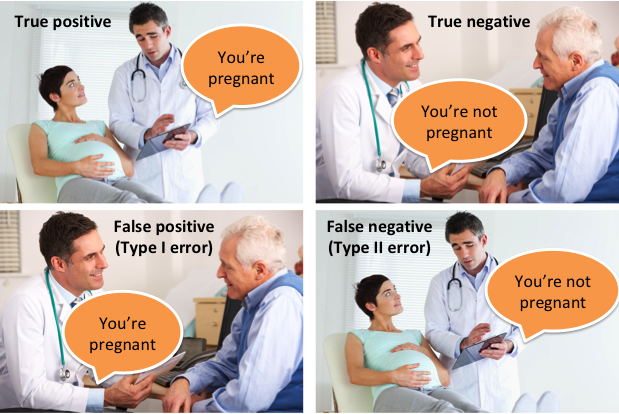
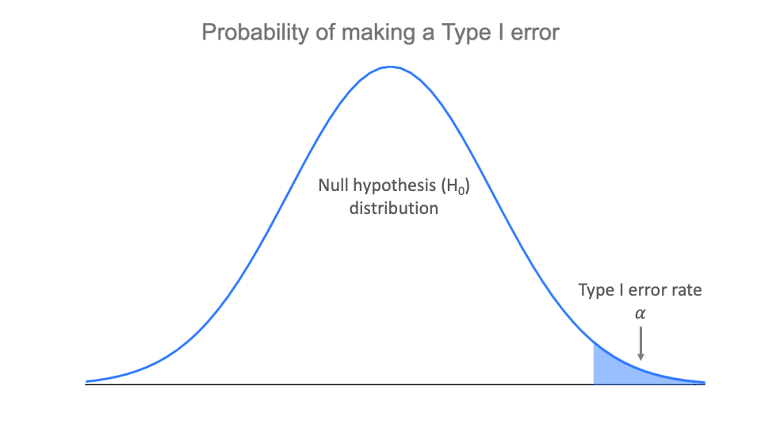
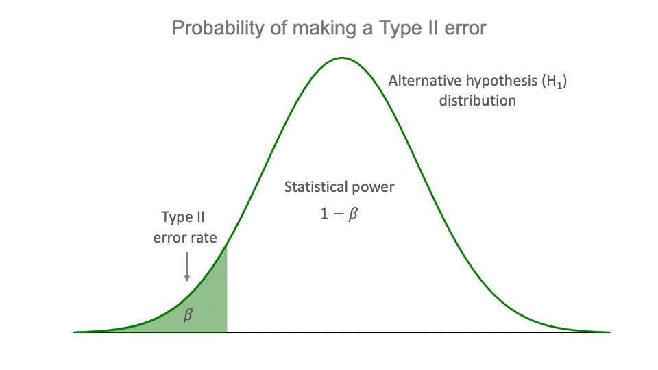
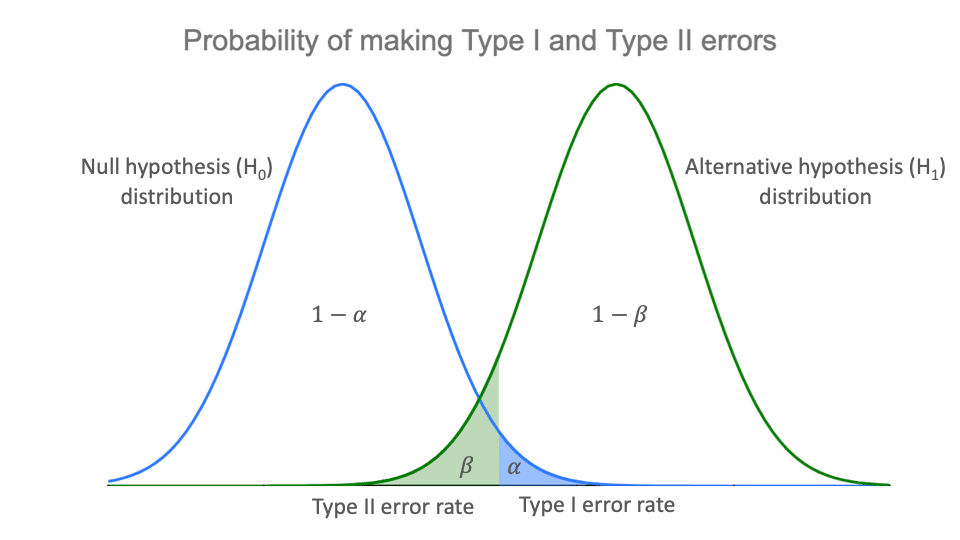

```{r setup, include=FALSE}
knitr::opts_chunk$set(echo = FALSE)
```

```{r echo=FALSE, eval=TRUE,message=FALSE, warning=FALSE}
library(tidyverse)
library(openintro)
library(gridExtra)
library(latex2exp)
data(COL)
seed <- 42
```

## Objectives

:::: {.column width=15%}
::::

:::: {.column width=70%}
- **Introduce hypothesis testing**
- **Know how to differentiate between null and alternative sampling distributions**
- **Develop an understanding of decision errors**
::::

:::: {.column width=15%}
::::

## Introduction to Hypothesis Testing

**Hypothesis testing** is a statistical method used to make inferences about a population based on a sample. It helps determine if an observed effect is statistically significant.

:::: {.column width=49%}
**Key Concepts:**

* *Null Hypothesis ($H_0$):* Assumes no effect or no difference.
* *Alternative Hypothesis ($H_A$):* Represents what we aim to support (effect or difference exists).
* *Significance Level ($\alpha$):* The probability of rejecting $H_0$ when it is true.
* *Test Statistic:* A value calculated from sample data to assess evidence against $H_0$.
* *P-value:* The probability of observing data as extreme as the sample, assuming $H_0$ is true.
* *Conclusion:* Compare p-value with $\alpha$ to decide whether to reject $H_0$ or not.
::::

:::: {.column width=49%}
**Decision Rule:**

* If $\text{p-value} < \alpha$, reject $H_0 \longrightarrow$ Evidence supports $H_A$.
* If $\text{p-value} \ge \alpha$, fail to reject $H_0 \longrightarrow$ Not enough evidence for $H_A$.

**Why is Hypothesis Testing Important?**

* Supports decision-making in research
* Helps determine if results are due to chance or a real effect
::::

## Testing New Drugs

A pharmaceutical company tests whether a new drug improves recovery rates compared to a placebo.

:::: {.column width=49%}
**Null Hypothesis $H_0$:**

* The new drug has no effect (the recovery rate is the same as the placebo).

**Alternative Hypothesis $H_A$:**

* The new drug improves recovery rates (higher than the placebo).

**Significance Level $\alpha$:**

* $\alpha = 0.05$ or a $5$\% decision error rate
::::

:::: {.column width=49%}
**Test Results:**

* After conducting a clinical trial, the statistical test produces a **p-value of 0.02**.

**Conclusion:**

* Since **p-value (0.02) < significance level (0.05)**, we **reject \(H_0\)**.
* This suggests that there is **strong statistical evidence** that the new drug improves recovery rates compared to the placebo.
::::

## Outcomes of Hypothesis Testing

There are two possible outcomes of the hypothesis test:

* **Reject** $H_0$: If the **p-value** is less than the **significance level**, then we reject the null hypothesis. Then,  we have enough evidence to support $H_A$.
  
* **Fail to Reject** $H_0$: If the **p-value** is greater than or equal to the **significance level**, then we fail to reject the null hypothesis. This does not mean the the null hypothesis is true.
  
Making statistical decisions means that you have to deal with uncertainties.

## Decision Errors

```{r decision-errors-meme, out.width = "55%", fig.align='center',fig.cap = "Image Source: [Statistical Performance Measures by Neeraj Kumar Vaid](https://neeraj-kumar-vaid.medium.com/statistical-performance-measures-12bad66694b7){target=_blank}"}

```

This meme might be over used. If you find some memes similar to this but in "non-pregnancy" context, let me know.

## The Significance Level and Decisions Errors

**What does this all mean?** When the p-value is small, i.e., less than a previously set threshold ($\alpha$), we say the results are **statistically significant**.  The value of $\alpha$ represents how rare an event needs to be in order for the null hypothesis to be rejected. The $\alpha$ also represents the probability of committing a type I error.

| Reality/Decision | **Reject $H_0$**                                                      | **Fail to reject $H_0$**                                                  |
|------------------|-------------------------------------------------------------------|-----------------------------------------------------------------------|
| **$H_0$ is true**    | Type I error<br>with probability $\alpha$<br>(significance level) | Correct decision<br>with probability $1-\alpha$<br>(confidence level) |
| **$H_0$ is false**   | Correct decision<br>with probability $1-\beta$<br>(power of test) | Type II error<br>with probability $\beta$                             |
Conclusion errors: Type I error (false positive) or Type II error (false negative)

## Null vs Alternative Sampling Distributions

:::: {.column width=49%}
```{r type-1-dist, out.width="100%", fig.cap = "", fig.align='center'}

```
::::

:::: {.column width=49%}
```{r type-2-dist, out.width="100%", fig.cap = "", fig.align='center'}

```
::::

## Trade-offs between Type I and Type II Errors

```{r type-1-and-2-dist, out.width="70%", fig.align='center',fig.cap = "Images Source: [Type I and Type II errors by Pritha Bhandari](https://www.scribbr.com/statistics/type-i-and-type-ii-errors/){target=_blank}"}

```

## US Court

In a US court, the defendant is either innocent ($H_0$) or guilty ($H_A$).

:::: {.column width=49%}
**What does a Type I Error represent in this context?**

* If the court makes a **Type I Error**, this means the defendant is innocent ($H_0$ is true) but wrongly convicted.
::::

:::: {.column width=49%}
**What does a Type II Error represent?**
  
* A **Type II Error** means the court failed to reject $H_0$ (i.e., failed to convict the person) when they were in fact guilty ($H_A$ true).
::::
  
## Type I Error Consequences

**A Type I error occurs when the null hypothesis is incorrectly rejected, leading to a wrongful conviction.**

* This means that an innocent person is found guilty and sentenced, possibly facing imprisonment or even capital punishment.
* The consequences extend beyond the individual, affecting their family, reputation, and future opportunities.
* The real perpetrator remains free, potentially committing further crimes.

## Type II error Consequences

**A Type II error occurs when the null hypothesis was failed to reject, leading to a wrongful acquittal.**

* This means that a guilty person is found not guilty and released. As a result, justice is not served for the victims, and the criminal may go on to commit additional offenses, putting society at risk.
* This error can undermine public trust in the legal system, as it fails to hold the guilty accountable.
